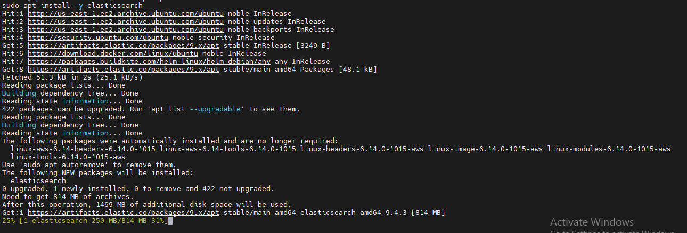
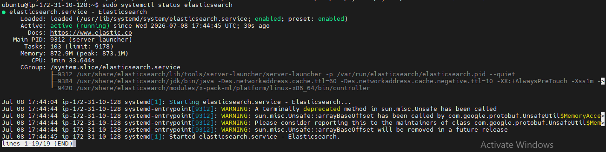

# 🧪 Lab 01: Installing Elasticsearch

## 📌 Lab Summary

In this lab, Elasticsearch was installed on an Ubuntu Linux system using the official Elastic APT repository. The installation process included configuring the Elastic repository, installing Elasticsearch, reviewing JVM settings, enabling the service, starting Elasticsearch, resetting the default administrator password, and verifying that the service was running successfully.

---

## 🎯 Objectives

- Understand the prerequisites for installing Elasticsearch.
- Install Elasticsearch using the official Elastic APT repository.
- Configure the Java Virtual Machine (JVM) settings.
- Enable and start the Elasticsearch service.
- Verify that Elasticsearch is running correctly.
- Reset the password for the default **elastic** user.

---

## 🖥️ Lab Environment

| Component | Details |
|-----------|----------|
| Operating System | Ubuntu Linux |
| Package Manager | APT |
| Elasticsearch Version | 9.x |
| Installation Method | Official Elastic APT Repository |
| Service Manager | systemd |

---

# ⚙️ Installation Steps

## Step 1 – Update the System

Update the package index to ensure all package information is current.

```bash
sudo apt update
```

---

## Step 2 – Install Required Dependencies

Install the packages required for downloading and verifying Elasticsearch packages.

```bash
sudo apt install -y wget gnupg apt-transport-https
```

---

## Step 3 – Add the Elastic GPG Key

Import the official Elastic GPG key to verify package authenticity.

```bash
wget -qO - https://artifacts.elastic.co/GPG-KEY-elasticsearch | sudo gpg --dearmor -o /usr/share/keyrings/elasticsearch-keyring.gpg
```

---

## Step 4 – Add the Elastic Repository

Add the official Elastic APT repository to the system.

```bash
echo "deb [signed-by=/usr/share/keyrings/elasticsearch-keyring.gpg] https://artifacts.elastic.co/packages/9.x/apt stable main" | sudo tee /etc/apt/sources.list.d/elastic-9.x.list
```

---

## Step 5 – Update the Package List

Refresh the package list after adding the new repository.

```bash
sudo apt update
```

---

## Step 6 – Install Elasticsearch

Install Elasticsearch from the official repository.

```bash
sudo apt install -y elasticsearch
```

---

## Step 7 – Review JVM Configuration

Open the JVM configuration file to review or adjust memory settings if required.

```bash
sudo nano /etc/elasticsearch/jvm.options
```

---

## Step 8 – Reload Systemd

Reload the systemd daemon so it recognizes the Elasticsearch service.

```bash
sudo systemctl daemon-reload
```

---

## Step 9 – Enable Elasticsearch Service

Configure Elasticsearch to start automatically during system boot.

```bash
sudo systemctl enable elasticsearch
```

---

## Step 10 – Start Elasticsearch

Start the Elasticsearch service.

```bash
sudo systemctl start elasticsearch
```

---

## Step 11 – Reset the Elastic User Password

Generate and save a new password for the default **elastic** administrator account.

```bash
sudo /usr/share/elasticsearch/bin/elasticsearch-reset-password -u elastic -i
```

---

# ✅ Verification

Verify that Elasticsearch is running successfully.

```bash
sudo systemctl status elasticsearch
```

Expected Result:

- Elasticsearch service is **active (running)**.
- The service starts without errors.
- Elasticsearch is ready to accept requests.

---

# 📚 Key Concepts Learned

- Installing Elasticsearch using the official Elastic repository.
- Managing APT repositories and GPG keys.
- Understanding JVM configuration for Elasticsearch.
- Managing Linux services with **systemd**.
- Enabling services to start automatically on boot.
- Resetting the default Elasticsearch administrator password.
- Verifying service status after installation.

---

# 📸 Screenshots

## Elasticsearch Installation



---

## Elasticsearch Service Status



---

# 🛠️ Commands Used

```bash
sudo apt update

sudo apt install -y wget gnupg apt-transport-https

wget -qO - https://artifacts.elastic.co/GPG-KEY-elasticsearch | sudo gpg --dearmor -o /usr/share/keyrings/elasticsearch-keyring.gpg

echo "deb [signed-by=/usr/share/keyrings/elasticsearch-keyring.gpg] https://artifacts.elastic.co/packages/9.x/apt stable main" | sudo tee /etc/apt/sources.list.d/elastic-9.x.list

sudo apt update

sudo apt install -y elasticsearch

sudo nano /etc/elasticsearch/jvm.options

sudo systemctl daemon-reload

sudo systemctl enable elasticsearch

sudo systemctl start elasticsearch

sudo systemctl status elasticsearch

sudo /usr/share/elasticsearch/bin/elasticsearch-reset-password -u elastic -i
```

---

# 🎯 Skills Gained

- Elasticsearch Installation
- Linux System Administration
- APT Package Management
- Repository Configuration
- GPG Key Management
- Service Management using systemd
- JVM Configuration
- Password Management
- SIEM Infrastructure Setup

---

# ✅ Conclusion

This lab demonstrated the complete installation and initial configuration of Elasticsearch on Ubuntu Linux using the official Elastic APT repository. The repository and GPG key were configured, Elasticsearch was installed, the service was enabled and started, JVM settings were reviewed, and the default administrator password was reset. Finally, the service status was verified, providing a fully functional Elasticsearch installation ready for integration with Kibana, Logstash, and other SIEM components.
