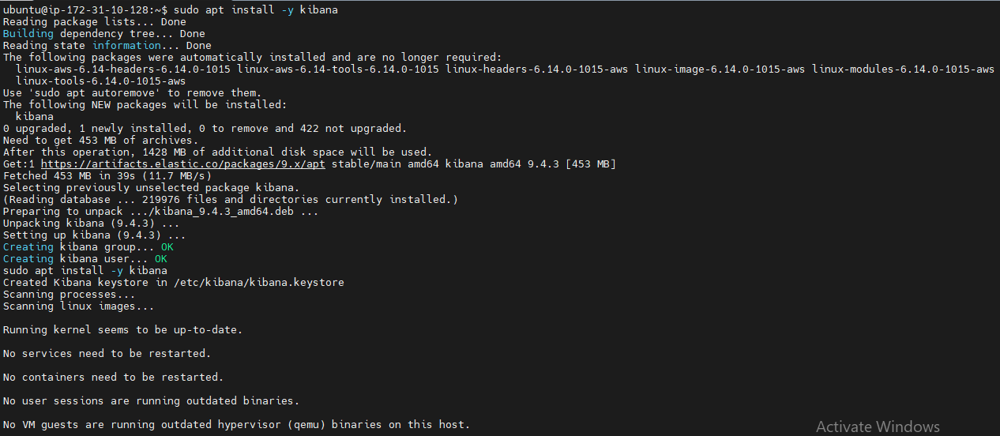
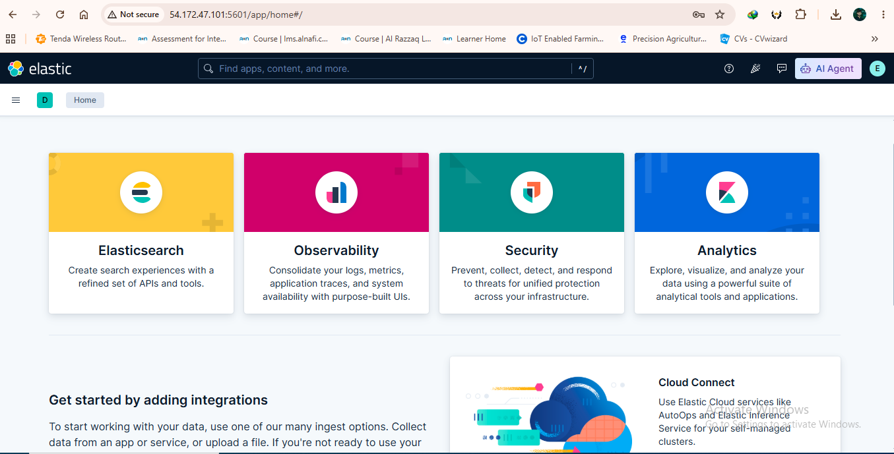

# 🧪 Lab 02: Installing Kibana

## 📌 Lab Summary

In this lab, Kibana was installed on an Ubuntu Linux system using the official Elastic APT repository. The configuration included connecting Kibana to an existing Elasticsearch instance, configuring network settings, generating encryption keys, enabling the Kibana service, creating an enrollment token, and accessing the Kibana web interface successfully.

---

## 🎯 Objectives

- Install Kibana using the official Elastic repository.
- Configure Kibana to communicate with Elasticsearch.
- Generate Kibana encryption keys.
- Enable and start the Kibana service.
- Generate an enrollment token for secure setup.
- Access the Kibana web interface.
- Verify successful connectivity with Elasticsearch.

---

## 🖥️ Lab Environment

| Component | Details |
|-----------|----------|
| Operating System | Ubuntu Linux |
| Package Manager | APT |
| Kibana Version | 9.x |
| Elasticsearch | Installed and Running |
| Installation Method | Official Elastic APT Repository |
| Service Manager | systemd |

---

# ⚙️ Installation Steps

## Step 1 – Install Kibana

Install Kibana using the official Elastic repository.

```bash
sudo apt install -y kibana
```

---

## Step 2 – Configure Kibana

Open the Kibana configuration file.

```bash
sudo nano /etc/kibana/kibana.yml
```

Update the following configuration:

```yaml
server.host: "0.0.0.0"
server.port: 5601
elasticsearch.hosts: ["https://localhost:9200"]
```

### Configuration Explanation

- **server.host** allows remote access to the Kibana web interface.
- **server.port** specifies the port on which Kibana listens.
- **elasticsearch.hosts** defines the Elasticsearch instance that Kibana connects to.

Save the file.

---

## Step 3 – Generate Kibana Encryption Keys

Generate encryption keys required for Kibana security features.

```bash
sudo /usr/share/kibana/bin/kibana-encryption-keys generate
```

---

## Step 4 – Enable Kibana Service

Configure Kibana to start automatically during system boot.

```bash
sudo systemctl enable kibana
```

---

## Step 5 – Start Kibana

Start the Kibana service.

```bash
sudo systemctl start kibana
```

---

## Step 6 – Generate Kibana Enrollment Token

Generate an enrollment token to securely connect Kibana with Elasticsearch.

```bash
sudo /usr/share/elasticsearch/bin/elasticsearch-create-enrollment-token -s kibana
```

Copy and save the generated enrollment token.

---

## Step 7 – Generate Verification Code

Generate the Kibana verification code.

```bash
sudo /usr/share/kibana/bin/kibana-verification-code
```

Copy the verification code.

---

## Step 8 – Access Kibana

Open a web browser and navigate to:

```text
http://34.229.150.201:5601
```

Complete the enrollment process using the generated enrollment token and verification code.

---

# ✅ Verification

Verify that Kibana is running correctly.

```bash
sudo systemctl status kibana
```

Expected Result:

- Kibana service is **active (running)**.
- Kibana successfully connects to Elasticsearch.
- The login page loads in the browser.
- Enrollment completes successfully.

---

# 📚 Key Concepts Learned

- Installing Kibana using the Elastic repository.
- Configuring Kibana through **kibana.yml**.
- Connecting Kibana to Elasticsearch.
- Understanding **server.host** and **server.port**.
- Generating Kibana encryption keys.
- Using enrollment tokens for secure setup.
- Managing services with **systemd**.
- Accessing Kibana remotely through a web browser.

---

# 📸 Screenshots

## Kibana Installation



---

## Kibana Dashboard



---

# 🛠️ Commands Used

```bash
sudo apt install -y kibana

sudo nano /etc/kibana/kibana.yml

sudo /usr/share/kibana/bin/kibana-encryption-keys generate

sudo systemctl enable kibana

sudo systemctl start kibana

sudo systemctl status kibana

sudo /usr/share/elasticsearch/bin/elasticsearch-create-enrollment-token -s kibana

sudo /usr/share/kibana/bin/kibana-verification-code
```

---

# 🎯 Skills Gained

- Kibana Installation
- Kibana Configuration
- Elasticsearch Integration
- Linux System Administration
- APT Package Management
- Service Management using systemd
- Enrollment Token Management
- Encryption Key Generation
- SIEM Infrastructure Setup

---

# ✅ Conclusion

In this lab, Kibana was successfully installed and configured on Ubuntu Linux using the official Elastic APT repository. The Kibana configuration file was updated to connect securely with Elasticsearch, encryption keys were generated, and the service was enabled and started using systemd. An enrollment token and verification code were created to complete the secure setup process. Finally, the Kibana web interface was accessed successfully, confirming a working connection with Elasticsearch and preparing the environment for data visualization, log analysis, and SIEM operations.
