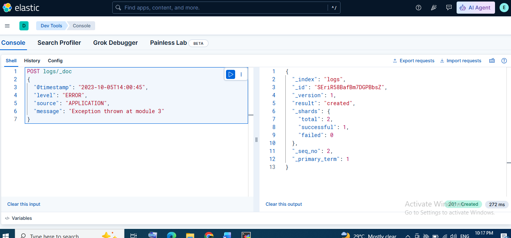
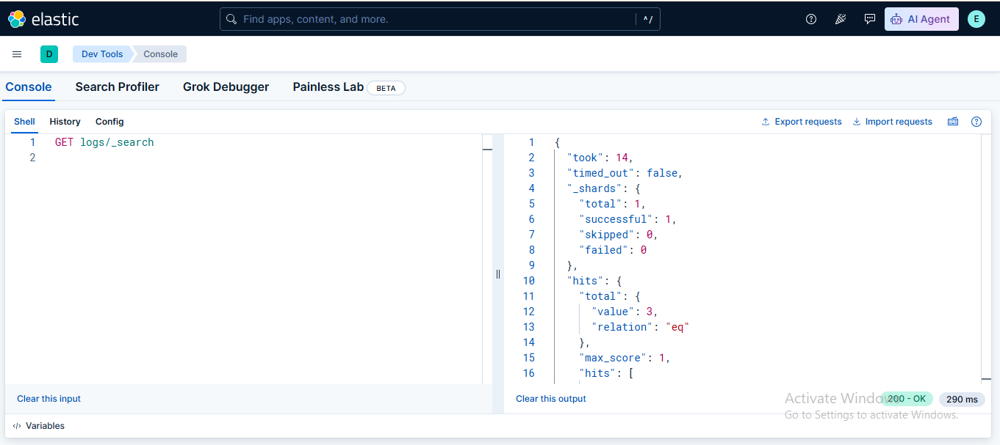

# 🧪 Lab 04: Loading Sample Log Data

## 📌 Lab Summary

In this lab, sample log data was manually indexed into Elasticsearch using **Kibana Dev Tools**. A new index named **logs** was created, log documents were inserted using the Elasticsearch REST API, and the indexed data was verified using both the Search API and Kibana Discover. This lab demonstrates the basic process of ingesting and validating log data in the Elastic Stack.

---

## 🎯 Objectives

- Understand the structure of log data.
- Create an Elasticsearch index for storing logs.
- Insert log documents using the REST API.
- Retrieve indexed data using search queries.
- Verify indexed logs in Kibana Discover.

---

## 🖥️ Lab Environment

| Component | Details |
|-----------|----------|
| Operating System | Ubuntu Linux |
| Elasticsearch Version | 9.x |
| Kibana Version | 9.x |
| Interface | Kibana Dev Tools |
| Index Name | logs |

---

# ⚙️ Lab Tasks

## Step 1 – Create a Log Index

A new Elasticsearch index named **logs** was created.

```http
PUT logs
```

---

## Step 2 – Insert Sample Log Data

A sample log document was inserted into the index.

```http
POST logs/_doc
{
  "@timestamp": "2023-10-05T13:45:30",
  "level": "INFO",
  "source": "APPLICATION",
  "message": "User login successful"
}
```

Additional log entries can be inserted in the same way.

Example:

```http
POST logs/_doc
{
  "@timestamp": "2023-10-05T13:46:12",
  "level": "WARN",
  "source": "DATABASE",
  "message": "Slow query detected"
}
```

```http
POST logs/_doc
{
  "@timestamp": "2023-10-05T14:00:45",
  "level": "ERROR",
  "source": "APPLICATION",
  "message": "Exception thrown at module 3"
}
```

---

## Step 3 – Verify Indexed Data

Retrieve all indexed documents.

```http
GET logs/_search
```

The search response confirms that the documents have been successfully indexed.

---

## Step 4 – Verify Data in Kibana Discover

- Open **Discover**.
- Create a **logs** data view (if it does not already exist).
- Select the **logs** data view.
- Verify that all inserted log entries are displayed correctly.

---

# ✅ Verification

The lab was successfully completed after:

- A new index was created.
- Sample log documents were indexed.
- Search API returned the inserted documents.
- Log data was successfully viewed in Kibana Discover.

---

# 📚 Key Concepts Learned

- Log Data
- Elasticsearch Index
- JSON Documents
- REST APIs
- Data Ingestion
- Search API
- Kibana Discover
- Log Analysis

---

# 📸 Screenshots

## Creating Index and Inserting Log Data



---

## Viewing Indexed Logs in Kibana Discover



---

# 🎯 Skills Gained

- Elasticsearch Index Management
- Log Data Ingestion
- REST API Usage
- Kibana Dev Tools
- Searching Documents
- Discover Dashboard
- Elastic Stack Fundamentals

---

# ✅ Conclusion

In this lab, log data was successfully ingested into Elasticsearch using Kibana Dev Tools. A new index was created, sample log documents were indexed, and the data was verified using both the Search API and Kibana Discover. This exercise provided practical experience with manual data ingestion and searching, forming the foundation for future log management, SIEM, and security analytics workflows.
