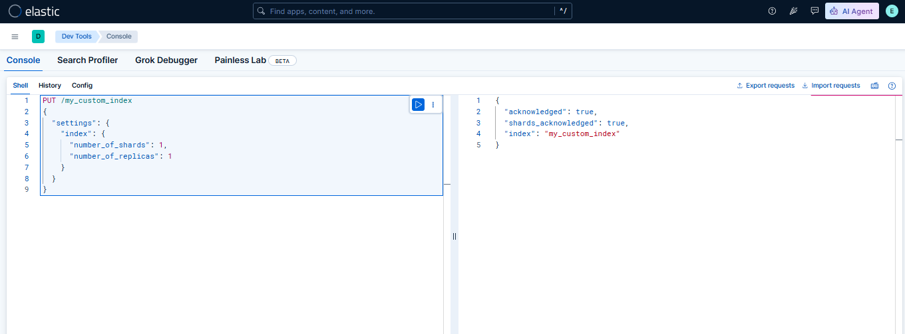

# 🧪 Lab 05: Understanding Indices, Shards, and Replicas

## 📌 Lab Summary

In this lab, we explored the core storage architecture of Elasticsearch by creating a custom index with specific shard and replica settings. We also inspected shard allocation and understood how shards and replicas affect search performance, scalability, and fault tolerance.

---

## 🎯 Objectives

- Understand Elasticsearch indices, shards, and replicas.
- Create a custom index with 1 primary shard and 1 replica.
- View shard allocation using the Cat API.
- Learn how shard and replica settings impact performance and availability.

---

## 🛠️ Lab Environment

- Ubuntu 24.04 LTS (AWS EC2)
- Elasticsearch 9.4.3
- Kibana 9.4.3
- Kibana Dev Tools

---

# Task 1: Create a Custom Index

## Command

```http
PUT /my_custom_index
{
  "settings": {
    "index": {
      "number_of_shards": 1,
      "number_of_replicas": 1
    }
  }
}
```

### Expected Output

```json
{
  "acknowledged": true,
  "shards_acknowledged": true,
  "index": "my_custom_index"
}
```

---

# Task 2: Verify Shard Allocation

## Command

```http
GET _cat/shards/my_custom_index?v
```

### Example Output

```
index             shard prirep state      docs store node
my_custom_index   0     p      STARTED      0  208b ip-172-31-10-136
my_custom_index   0     r      UNASSIGNED
```

---

# Task 3: Verify Index Health

```http
GET _cat/indices?v
```

Example

```
health status index             pri rep docs.count
yellow open   my_custom_index    1   1     0
```

> **Note:** Since this lab uses a single Elasticsearch node, the replica shard remains **UNASSIGNED**, causing the index health to appear **Yellow**. This is expected behavior.

---

# What We Learned

- Created a new Elasticsearch index.
- Configured custom shard and replica settings.
- Viewed shard allocation.
- Understood why replicas remain unassigned on a single-node cluster.
- Learned how shards improve scalability and replicas improve fault tolerance.

---

# 📸 Screenshots

## Screenshot 1: Creating a Custom Index

The following screenshot shows the successful creation of the **my_custom_index** with **1 primary shard** and **1 replica** using Kibana Dev Tools.



---

## Screenshot 2: Viewing Shard Allocation

The following screenshot displays the shard allocation for **my_custom_index**, showing the primary shard and replica status. In a single-node cluster, the replica shard remains **UNASSIGNED**, resulting in a **Yellow** index health, which is expected behavior.


# Commands Used

```http
PUT /my_custom_index
```

```http
GET _cat/shards/my_custom_index?v
```

```http
GET _cat/indices?v
```

---

# Conclusion

This lab introduced the internal storage architecture of Elasticsearch. We learned how indices are divided into shards and how replicas provide redundancy. On a single-node cluster, replica shards cannot be allocated, which results in a yellow index health status. Understanding these concepts is essential before working with larger Elasticsearch clusters.
