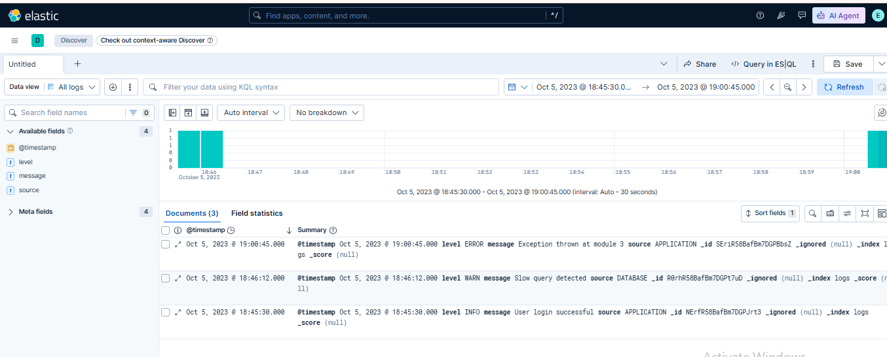
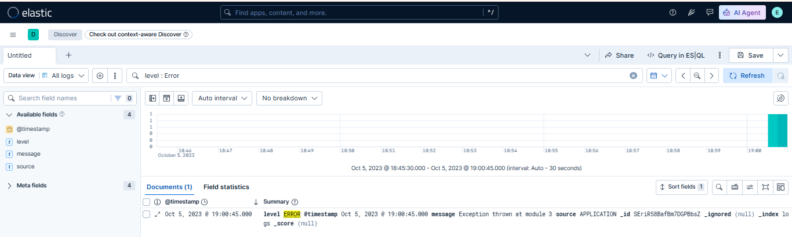

# 🧪 Lab 06: Basic Kibana Discover Usage

## 📌 Lab Summary

In this lab, Kibana's **Discover** feature was used to explore and analyze indexed log data stored in Elasticsearch. The lab covered selecting an index, adjusting the time range, applying filters, sorting results, and saving a Discover view for future use. These features are essential for log investigation, threat hunting, and security monitoring in a SIEM environment.

---

## 🎯 Objectives

- Understand how to use Kibana Discover.
- Select an Elasticsearch index for analysis.
- Adjust the time range to view specific events.
- Apply filters to narrow search results.
- Sort log entries by different fields.
- Save a Discover view for future investigations.

---

## 🛠️ Lab Environment

| Component | Details |
|-----------|---------|
| Operating System | Ubuntu 24.04 LTS |
| Elasticsearch | 9.x |
| Kibana | 9.x |
| Browser | Google Chrome |
| Platform | AWS EC2 |

---

# Task 1: Open Kibana Discover

Open Kibana in your browser.

Navigate to:

**Analytics → Discover**

From the Data View (Index Pattern) dropdown, select the index you want to analyze.

Example:

```
sample_logs
```

The Discover page displays all available documents from the selected index.

---

# Task 2: Adjust the Time Range

Click the **Time Picker** located in the upper-right corner.

Select a suitable time range such as:

- Last 15 minutes
- Last 24 hours
- Last 7 days
- Custom Range

Click **Apply**.

Kibana refreshes the displayed data according to the selected time period.

---

# Task 3: Apply Filters

Click **Add Filter**.

Choose a field.

Example:

```
log.level
```

Select the condition:

```
is
```

Enter the value:

```
ERROR
```

Click **Save**.

Only matching log entries will now be displayed.

---

# Task 4: Sort Log Entries

Click on the **@timestamp** column header.

Click again to switch between:

- Ascending
- Descending

Sorting helps quickly identify the newest or oldest events.

---

# Task 5: Save the Discover View

Click the **Save** button.

Enter a name.

Example:

```
Last 24 Hours Errors
```

Click **Save**.

The saved Discover view can now be reopened anytime.

---

# Verification

The lab was successfully completed after verifying:

- Kibana Discover opened successfully.
- Data View (Index Pattern) was selected.
- Indexed documents were displayed.
- Time range filtering worked correctly.
- Filters successfully refined search results.
- Sorting displayed logs in the required order.
- Discover view was saved successfully.

---

# Screenshots

## Screenshot 1

**Kibana Discover showing the selected index and available log data.**



---

## Screenshot 2

**Applied filter, sorted results, and saved Discover view.**



---

# Commands Used

No terminal commands were required in this lab.

All tasks were completed using the **Kibana Discover** graphical interface.

---

# Key Concepts

### Discover

The primary Kibana interface used to search, inspect, and analyze documents stored in Elasticsearch.

### Data View (Index Pattern)

A logical reference that tells Kibana which Elasticsearch indices should be searched and displayed.

### Time Picker

Filters documents based on their timestamp, allowing analysts to focus on a specific time period.

### Filter

Limits search results based on field values, making investigations faster and more precise.

### Sorting

Arranges log entries in ascending or descending order based on selected fields such as timestamps.

### Saved Discover View

Stores the current search configuration, including filters, sorting, visible columns, and time range for future use.

---

# Lab Outcome

After completing this lab, I successfully:

- Accessed Kibana Discover.
- Selected an Elasticsearch index.
- Adjusted the time range.
- Applied filters to narrow search results.
- Sorted log entries by timestamp.
- Saved a reusable Discover view.

This lab provided practical experience with Kibana's Discover interface and established the foundation for efficient log analysis, security monitoring, and incident investigation using the Elastic Stack.

---

# Conclusion

This lab introduced the core functionality of **Kibana Discover** for exploring Elasticsearch data. By selecting an index, filtering logs, adjusting time ranges, sorting events, and saving Discover views, I gained hands-on experience with one of the most commonly used features in the Elastic Stack. These skills are essential for SOC analysts, security engineers, and anyone working with log analysis and SIEM platforms.
