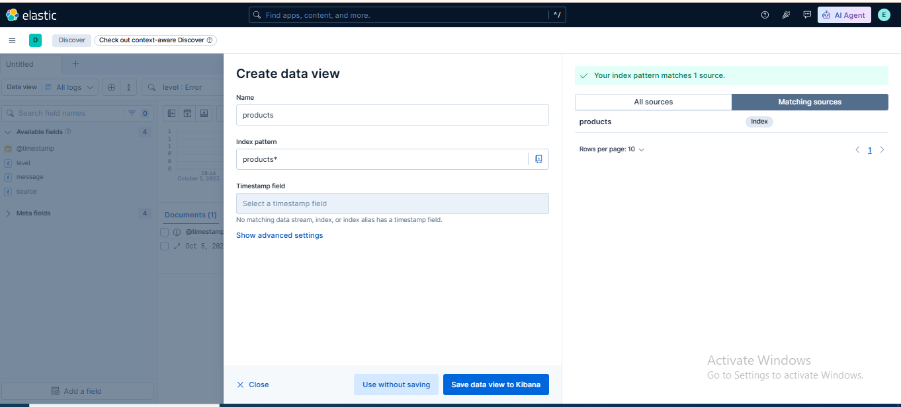
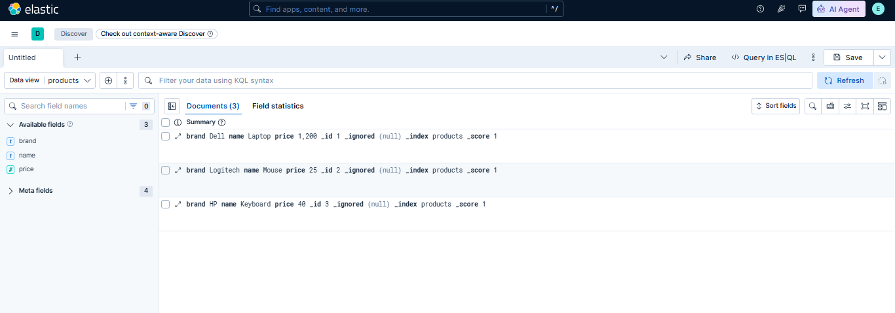

# 🧪 Lab 07: Creating an Index Pattern

## 📌 Lab Summary

In this lab, an **Index Pattern (Data View)** was created in Kibana to enable searching, filtering, and visualizing Elasticsearch data. The lab covered creating an index pattern, selecting a default time field, and verifying the data in the Discover module. Index patterns are essential because they allow Kibana to recognize and interact with Elasticsearch indices.

---

## 🎯 Objectives

- Understand the purpose of an Index Pattern (Data View).
- Create an Index Pattern matching an Elasticsearch index.
- Configure a default time field.
- Verify the Index Pattern using Kibana Discover.

---

## 🛠️ Lab Environment

| Component | Details |
|-----------|---------|
| Operating System | Ubuntu 24.04 LTS |
| Elasticsearch | 9.x |
| Kibana | 9.x |
| Browser | Google Chrome |
| Platform | AWS EC2 |

---

# Task 1: Open Stack Management

Open Kibana in your browser.

Navigate to:

**Management → Stack Management**

From the Kibana section, select:

**Data Views (Index Patterns)**

This section is used to manage all index patterns available in Kibana.

---

# Task 2: Create an Index Pattern

Click on **Create Data View** (Create Index Pattern).

Enter the index pattern.

Example:

```
sample_logs*
```

or

```
logs*
```

Kibana automatically checks whether matching indices exist in Elasticsearch.

Click **Next**.

---

# Task 3: Configure the Default Time Field

Select the timestamp field from the dropdown list.

Example:

```
@timestamp
```

The selected field will be used for:

- Time-based filtering
- Log sorting
- Dashboards
- Visualizations

Click **Create Data View** to complete the configuration.

---

# Task 4: Verify in Discover

Navigate to:

**Analytics → Discover**

Select the newly created Data View.

Verify that:

- Documents are displayed.
- Time filtering works correctly.
- Search and filters operate successfully.

If data appears successfully, the Index Pattern has been configured correctly.

---

# Verification

The lab was successfully completed after verifying:

- Stack Management opened successfully.
- Data View (Index Pattern) was created.
- Default time field was configured.
- Discover recognized the new Data View.
- Indexed documents were displayed correctly.

---

# Screenshots

## Screenshot 1

**Creating the Data View (Index Pattern) in Stack Management.**



---

## Screenshot 2

**Verifying the newly created Data View in Kibana Discover.**



---

# Commands Used

No terminal commands were required.

All tasks were completed using the **Kibana Web Interface**.

---

# Key Concepts

### Index Pattern (Data View)

A Data View (formerly called an Index Pattern) tells Kibana which Elasticsearch indices should be searched and displayed.

### Wildcard (*)

The asterisk (`*`) is a wildcard character that matches multiple indices with similar names.

Example:

```
logs-*
```

matches:

- logs-2026.07.01
- logs-2026.07.02
- logs-security

### Time Field

A timestamp field used by Kibana to perform time-based filtering, sorting, and visualization.

### Stack Management

The Kibana administration section where Data Views, Index Templates, Security settings, Saved Objects, and other configurations are managed.

### Discover

The Kibana module used to explore, search, and analyze indexed documents stored in Elasticsearch.

---

# Lab Outcome

After completing this lab, I successfully:

- Opened Stack Management.
- Created a new Data View (Index Pattern).
- Configured the default **@timestamp** field.
- Verified the Data View in Discover.
- Confirmed successful access to indexed documents.

This lab provided practical experience in connecting Kibana with Elasticsearch indices, making data exploration and visualization possible.

---

# Conclusion

This lab introduced the process of creating an **Index Pattern (Data View)** in Kibana. By configuring an index pattern and assigning a default time field, Kibana was able to access and display Elasticsearch data through the Discover module. This is a fundamental step before creating dashboards, visualizations, alerts, and performing advanced log analysis in the Elastic Stack.
