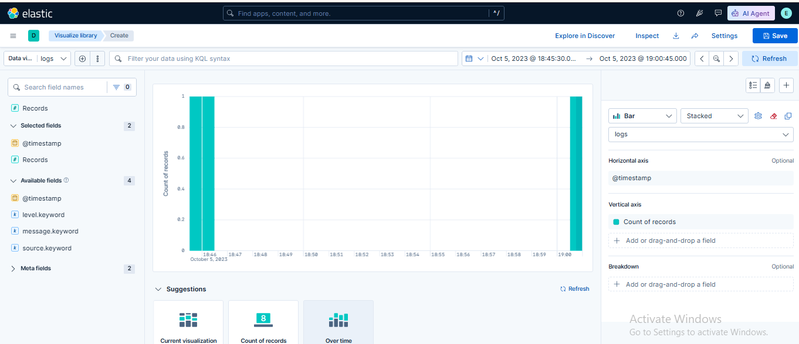
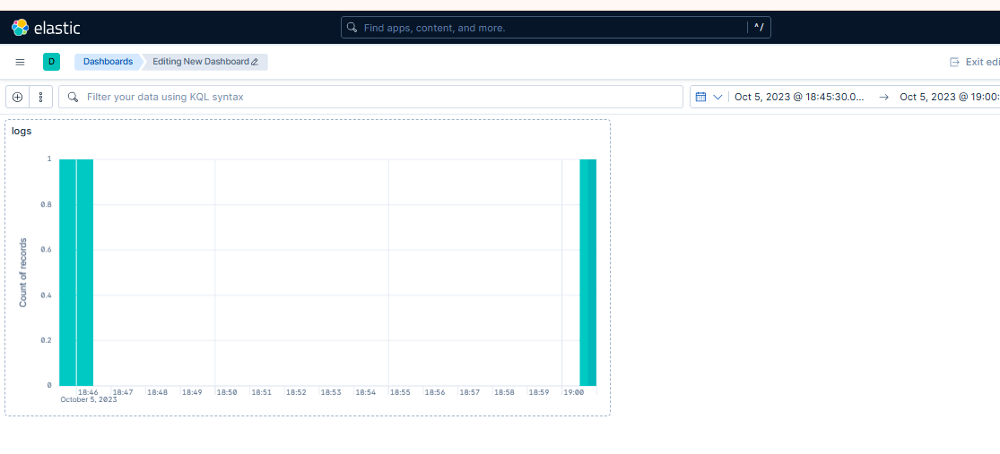

# 🧪 Lab 08: Using Kibana Lens for Basic Visualization

## 📌 Lab Summary

In this lab, Kibana **Lens** was used to create a basic visualization from Elasticsearch data. The lab covered opening the Lens editor, selecting a Data View, creating a chart using drag-and-drop functionality, customizing the visualization, and saving it for future use or dashboard integration. Kibana Lens provides an intuitive interface for transforming raw data into meaningful visual insights.

---

## 🎯 Objectives

- Understand how to access Kibana Lens.
- Create a basic visualization using Elasticsearch data.
- Customize the visualization.
- Save the visualization for future use.
- Learn how visualizations can be added to dashboards.

---

## 🛠️ Lab Environment

| Component | Details |
|-----------|---------|
| Operating System | Ubuntu 24.04 LTS |
| Elasticsearch | 9.x |
| Kibana | 9.x |
| Browser | Google Chrome |
| Platform | AWS EC2 |

---

# Task 1: Open Kibana Lens

Open Kibana in your browser.

Navigate to:

**Analytics → Visualize Library**

Click:

**Create Visualization**

Select:

**Lens**

The Kibana Lens editor opens with a drag-and-drop interface for creating visualizations.

---

# Task 2: Select the Dataset

Choose the Data View (Index Pattern).

Example:

```
sample_logs*
```

or

```
logs*
```

The available fields from the selected index appear on the left panel.

---

# Task 3: Create a Basic Visualization

Drag the desired field into the visualization workspace.

Example:

```
@timestamp
```

Kibana automatically generates a suggested visualization, such as a **Line Chart** showing the count of documents over time.

You can also choose different visualization types:

- Line Chart
- Bar Chart
- Pie Chart
- Area Chart
- Table

---

# Task 4: Customize the Visualization

Modify the visualization using the configuration panel.

Possible customizations include:

- Changing the chart type.
- Changing the aggregation (Count, Average, Maximum, Minimum).
- Selecting different fields.
- Adjusting the time range using the Time Picker.

Example:

```
Last 7 Days
```

The visualization updates automatically after each change.

---

# Task 5: Save the Visualization

Click the **Save** button.

Provide a meaningful name.

Example:

```
Log Count Over Time
```

Click **Save**.

Optionally, add the visualization to an existing dashboard or create a new dashboard.

---

# Verification

The lab was successfully completed after verifying:

- Kibana Lens opened successfully.
- Data View was selected.
- Visualization was generated automatically.
- Chart customization worked correctly.
- Visualization was saved successfully.

---

# Screenshots

## Screenshot 1

**Creating a visualization in Kibana Lens using the selected Data View.**



---

## Screenshot 2

**Saved visualization displayed in the Visualize Library or added to a Dashboard.**



---

# Commands Used

No terminal commands were required.

All tasks were completed using the **Kibana Lens** graphical interface.

---

# Key Concepts

### Kibana Lens

A drag-and-drop visualization tool in Kibana used to create charts without writing queries.

### Visualization

A graphical representation of Elasticsearch data that helps users identify trends and patterns.

### Data View (Index Pattern)

A logical reference that allows Kibana to access one or more Elasticsearch indices.

### Aggregation

A method of summarizing data, such as Count, Average, Maximum, Minimum, or Sum.

### Time Filter

A feature used to limit displayed data to a specific time range.

### Dashboard

A collection of visualizations that provides a centralized view of important metrics and log data.

---

# Lab Outcome

After completing this lab, I successfully:

- Opened Kibana Lens.
- Selected an Elasticsearch Data View.
- Created a basic visualization.
- Customized the chart.
- Saved the visualization.
- Learned how to integrate visualizations into dashboards.

This lab provided hands-on experience with Kibana Lens, making it easier to analyze Elasticsearch data visually and prepare dashboards for monitoring and reporting.

---

# Conclusion

This lab introduced **Kibana Lens**, a powerful drag-and-drop visualization tool within the Elastic Stack. By creating and customizing charts from Elasticsearch data, I learned how to transform raw logs into meaningful visual insights. These skills form the foundation for building interactive dashboards used in security monitoring, operational analytics, and business reporting.
