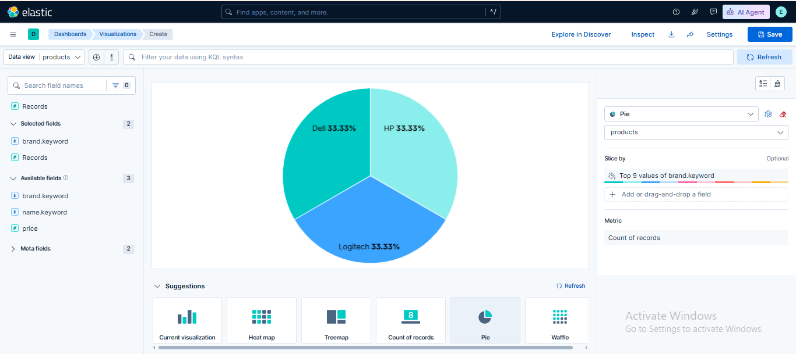
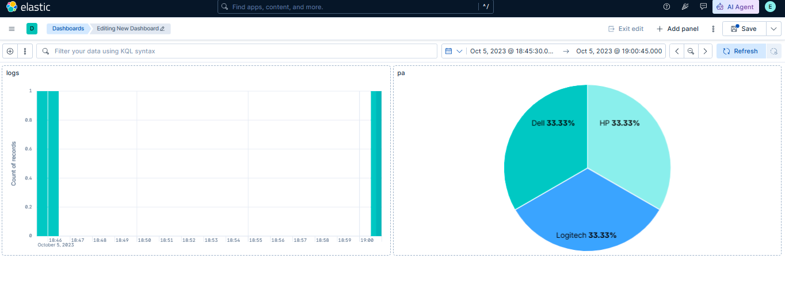

# 🧪 Lab 09: Building a Simple Kibana Dashboard

## 📌 Lab Summary

In this lab, a simple dashboard was created in Kibana to display multiple visualizations in a single view. The dashboard was built by adding an existing Lens visualization, creating an additional visualization, arranging the layout, and saving the dashboard. Dashboards provide a centralized interface for monitoring, analyzing, and presenting Elasticsearch data.

---

## 🎯 Objectives

- Understand how to create a new dashboard in Kibana.
- Add existing Lens visualizations to a dashboard.
- Create and add an additional visualization.
- Arrange and customize dashboard panels.
- Save the dashboard for future use.

---

## 🛠️ Lab Environment

| Component | Details |
|-----------|---------|
| Operating System | Ubuntu 24.04 LTS |
| Elasticsearch | 9.x |
| Kibana | 9.x |
| Browser | Google Chrome |
| Platform | AWS EC2 |

---

# Task 1: Create a New Dashboard

Open Kibana in your browser.

Navigate to:

**Analytics → Dashboard**

Click:

**Create Dashboard**

A blank dashboard workspace appears where visualizations can be added.

---

# Task 2: Add an Existing Lens Visualization

Click:

**Add from Library**

Search for the visualization created in the previous lab.

Example:

```
Log Count Over Time
```

Select the visualization and click:

**Add to Dashboard**

The visualization is now displayed on the dashboard.

Resize and reposition it using drag-and-drop.

---

# Task 3: Add Another Visualization

Click:

**Create Visualization**

Choose **Lens**.

Select the same Data View.

Example:

```
sample_logs*
```

Create another visualization such as:

- Bar Chart
- Pie Chart
- Data Table

Configure the required fields and save it.

Return to the dashboard.

Click:

**Add from Library**

Select the newly created visualization.

Arrange both visualizations on the dashboard.

---

# Task 4: Save the Dashboard

Click the **Save** button.

Provide a dashboard name.

Example:

```
Sample Dashboard
```

Optionally add a description.

Click **Save**.

The dashboard is now available under the Dashboard section for future use.

---

# Verification

The lab was successfully completed after verifying:

- Dashboard was created successfully.
- Existing Lens visualization was added.
- Additional visualization was created.
- Dashboard layout was customized.
- Dashboard was saved successfully.

---

# Screenshots

## Screenshot 1

**Creating a new Kibana Dashboard and adding an existing Lens visualization.**



---

## Screenshot 2

**Completed dashboard showing multiple visualizations after saving.**



---

# Commands Used

No terminal commands were required.

All tasks were completed using the **Kibana Dashboard** graphical interface.

---

# Key Concepts

### Dashboard

A dashboard is a collection of visualizations, saved searches, and other panels displayed together to monitor and analyze data.

### Lens Visualization

A drag-and-drop visualization created using Kibana Lens that can be reused in dashboards.

### Visualize Library

A repository where saved visualizations are stored and can be reused across multiple dashboards.

### Dashboard Panel

An individual visualization or saved search displayed inside a dashboard.

### Drag and Drop Layout

Allows users to resize and rearrange dashboard panels for better organization and readability.

### Saved Dashboard

A reusable dashboard configuration that preserves all added visualizations and layout settings.

---

# Lab Outcome

After completing this lab, I successfully:

- Created a new Kibana Dashboard.
- Added an existing Lens visualization.
- Created and added another visualization.
- Customized the dashboard layout.
- Saved the completed dashboard.

This lab provided practical experience in combining multiple visualizations into a single dashboard, making it easier to monitor and analyze Elasticsearch data in one centralized location.

---

# Conclusion

This lab demonstrated how to build a simple dashboard in **Kibana** by combining multiple visualizations into a single interactive workspace. Dashboards provide an efficient way to monitor system activity, analyze log data, and present insights visually. These skills form the foundation for creating operational, business, and security monitoring dashboards within the Elastic Stack.
