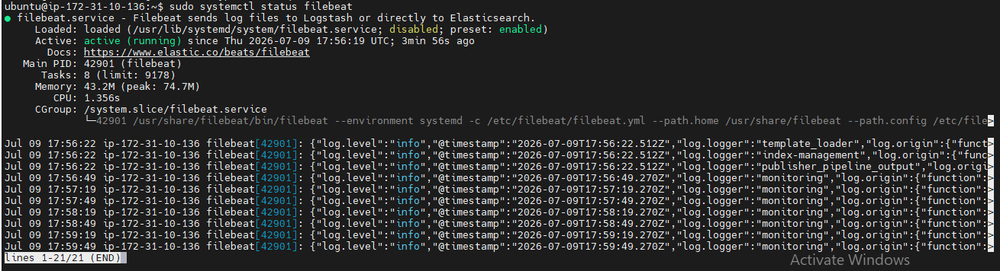
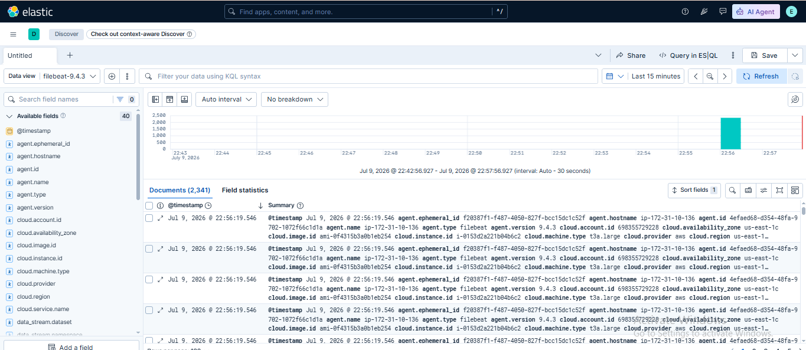

# 🧪 Lab 10: Introduction to Filebeat

## 📌 Lab Summary

In this lab, Filebeat was installed and configured to collect log files from the Linux system and forward them directly to Elasticsearch. The lab covered installing Filebeat, configuring log inputs and Elasticsearch output, starting the Filebeat service, and verifying that logs were successfully indexed in Elasticsearch. Filebeat acts as a lightweight log shipper within the Elastic Stack and is widely used for centralized log collection.

---

## 🎯 Objectives

- Understand the purpose of Filebeat in the ELK Stack.
- Install Filebeat on Ubuntu.
- Configure Filebeat to monitor system log files.
- Connect Filebeat with Elasticsearch.
- Verify successful log ingestion.

---

## 🛠️ Lab Environment

| Component | Details |
|-----------|---------|
| Operating System | Ubuntu 24.04 LTS |
| Elasticsearch | 9.x |
| Kibana | 9.x |
| Filebeat | 9.x |
| Platform | AWS EC2 |

---

# Task 1: Install Filebeat

Update the package repository.

```bash
sudo apt update
```

Install Filebeat.

```bash
sudo apt install filebeat -y
```

Verify the installation.

```bash
filebeat version
```

The installed version should be displayed successfully.

---

# Task 2: Configure Filebeat

Open the Filebeat configuration file.

```bash
sudo nano /etc/filebeat/filebeat.yml
```

Configure the input section.

```yaml
filebeat.inputs:
- type: filestream
  enabled: true
  paths:
    - /var/log/syslog
```

Configure Elasticsearch as the output destination.

```yaml
output.elasticsearch:
  hosts: ["https://localhost:9200"]
  username: "elastic"
  password: "YOUR_PASSWORD"
  ssl.verification_mode: none
```

Save and exit the configuration file.

---

# Task 3: Enable and Start Filebeat

Enable Filebeat to start automatically.

```bash
sudo systemctl enable filebeat
```

Start the Filebeat service.

```bash
sudo systemctl start filebeat
```

Verify the service status.

```bash
sudo systemctl status filebeat
```

The service should display **active (running)**.

---

# Task 4: Verify Data in Elasticsearch

Check whether Filebeat has created its index.

```bash
curl -k -u elastic https://localhost:9200/_cat/indices?v
```

Look for an index similar to:

```
filebeat-*
```

This confirms that Filebeat is successfully sending logs to Elasticsearch.

---

# Task 5: Verify Logs in Kibana

Open Kibana.

Navigate to:

**Analytics → Discover**

Select the Filebeat Data View.

Example:

```
filebeat-*
```

Verify that system log entries are visible.

---

# Verification

The lab was successfully completed after confirming:

- Filebeat installed successfully.
- Configuration file updated correctly.
- Filebeat service started successfully.
- Elasticsearch received Filebeat logs.
- Filebeat index appeared in Elasticsearch.
- Logs were visible in Kibana Discover.

---

# Screenshots

## Screenshot 1

**Filebeat service running successfully (`systemctl status filebeat`).**



---

## Screenshot 2

**Filebeat logs visible in Kibana Discover or Filebeat index visible in Elasticsearch.**



---

# Commands Used

```bash
sudo apt update

sudo apt install filebeat -y

filebeat version

sudo nano /etc/filebeat/filebeat.yml

sudo systemctl enable filebeat

sudo systemctl start filebeat

sudo systemctl status filebeat

curl -k -u elastic https://localhost:9200/_cat/indices?v
```

---

# Key Concepts

### Filebeat

A lightweight log shipping agent that collects log files and forwards them to Elasticsearch or Logstash for centralized monitoring.

### Input

Defines which log files Filebeat should monitor and collect.

### Output

Specifies the destination where Filebeat sends collected logs, such as Elasticsearch or Logstash.

### Elasticsearch Index

A storage location where Filebeat stores collected log events for searching and analysis.

### Service

A background process managed by **systemd** that continuously collects and forwards logs.

### Discover

A Kibana feature used to search, filter, and analyze logs received from Filebeat.

---

# Lab Outcome

After completing this lab, I successfully:

- Installed Filebeat.
- Configured Filebeat to monitor Linux system logs.
- Connected Filebeat to Elasticsearch.
- Started and enabled the Filebeat service.
- Verified successful log ingestion.
- Viewed Filebeat logs in Kibana Discover.

This lab provided practical experience with log collection and forwarding, which is one of the core components of the Elastic Stack.

---

# Conclusion

This lab introduced **Filebeat**, the lightweight log shipper used in the Elastic Stack. By installing and configuring Filebeat, I learned how to continuously collect Linux log files and forward them to Elasticsearch for centralized storage and analysis. Verifying the logs in Kibana confirmed successful integration, providing the foundation for building a complete logging, monitoring, and SIEM solution using the Elastic Stack.
