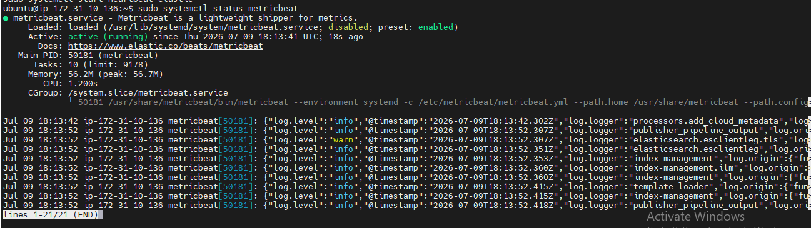
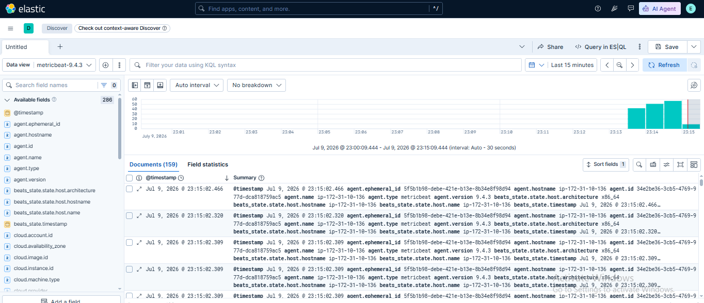

# Lab 11: Introduction to Metricbeat

## 📌 Lab Summary

In this lab, Metricbeat was installed and configured to collect system performance metrics from an Ubuntu server. The System module was enabled to gather CPU, memory, disk, network, and process metrics. The collected data was sent to Elasticsearch and verified through Kibana Discover for monitoring and analysis.

---

## 🎯 Objectives

- Understand the purpose of Metricbeat.
- Install Metricbeat on Ubuntu.
- Enable the System module.
- Configure Metricbeat to send metrics to Elasticsearch.
- Verify metrics in Elasticsearch and Kibana.

---

## 🛠️ Lab Environment

- Ubuntu Server (AWS EC2)
- Elasticsearch 9.x
- Kibana 9.x
- Metricbeat 9.x

---

# Step 1: Install Metricbeat

Updated the package repository and installed Metricbeat.

```bash
sudo apt update
sudo apt install metricbeat -y
```

---

# Step 2: Enable the System Module

Enabled the default System module to collect operating system metrics.

```bash
sudo metricbeat modules enable system
```

The System module collects:

- CPU Usage
- Memory Usage
- Disk Usage
- Filesystem Statistics
- Network Statistics
- Running Processes

---

# Step 3: Configure Metricbeat

Opened the Metricbeat configuration file.

```bash
sudo nano /etc/metricbeat/metricbeat.yml
```

Configured the Elasticsearch output.

```yaml
output.elasticsearch:
  hosts: ["http://localhost:9200"]
```

Saved the configuration file.

---

# Step 4: Start Metricbeat

Enabled the service to start automatically.

```bash
sudo systemctl enable metricbeat
```

Started Metricbeat.

```bash
sudo systemctl start metricbeat
```

Checked the service status.

```bash
sudo systemctl status metricbeat
```

---

# Step 5: Verify Elasticsearch Index

Verified that Metricbeat created its index.

```bash
curl -X GET "localhost:9200/_cat/indices?v"
```

Expected output:

```
metricbeat-*
```

---

# Step 6: Verify Data in Kibana

Opened **Kibana → Discover**.

Selected the **metricbeat-\*** data view.

Verified that CPU, Memory, Disk, Network, and Process metrics were successfully indexed.

---

# Commands Used

```bash
sudo apt update
sudo apt install metricbeat -y
sudo metricbeat modules enable system
sudo nano /etc/metricbeat/metricbeat.yml
sudo systemctl enable metricbeat
sudo systemctl start metricbeat
sudo systemctl status metricbeat
curl -X GET "localhost:9200/_cat/indices?v"
```

---

# What We Learned

- Installed Metricbeat on Ubuntu.
- Enabled the System module.
- Configured Metricbeat to communicate with Elasticsearch.
- Started and verified the Metricbeat service.
- Confirmed that Metricbeat created its index.
- Viewed collected system metrics in Kibana Discover.

---

# Key Concepts

| Term | Description |
|------|-------------|
| **Metricbeat** | Lightweight Elastic Beat used to collect system and service metrics. |
| **System Module** | Built-in module that collects CPU, memory, disk, process, and network metrics. |
| **Elasticsearch Output** | Sends collected metrics to Elasticsearch for indexing. |
| **Index** | Storage location where Metricbeat metrics are saved. |
| **Discover** | Kibana feature used to search and analyze indexed data. |

---

# Screenshots

## Screenshot 1

**Metricbeat Installation and Service Status**



---

## Screenshot 2

**Metricbeat Data in Kibana Discover**



---

# Conclusion

This lab demonstrated how to install, configure, and use Metricbeat for infrastructure monitoring. After enabling the System module and configuring the Elasticsearch output, Metricbeat successfully collected system metrics and stored them in Elasticsearch. These metrics were then explored in Kibana Discover, providing valuable insights into server performance and system health.
