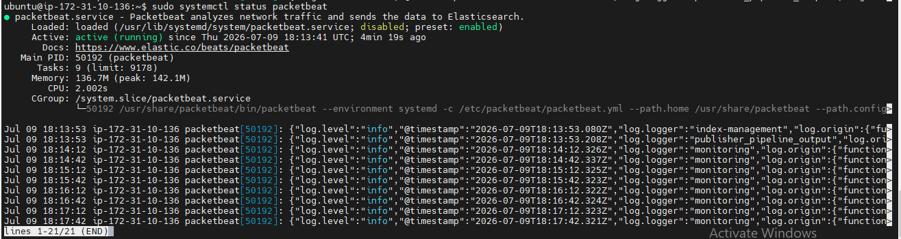
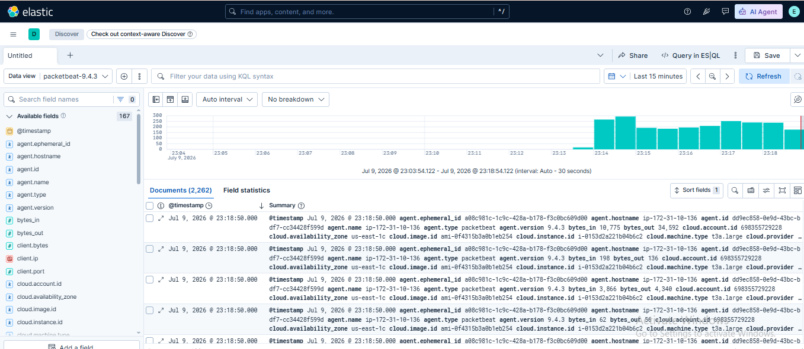

# Lab 12: Introduction to Packetbeat

## 📌 Lab Summary

In this lab, Packetbeat was installed and configured to monitor network traffic on an Ubuntu server. Packetbeat was connected to Elasticsearch, configured to capture DNS and HTTP traffic, and the collected network data was verified in Kibana using the Discover feature.

---

## 🎯 Objectives

- Understand the purpose of Packetbeat.
- Install Packetbeat on Ubuntu.
- Configure Packetbeat to communicate with Elasticsearch.
- Enable DNS and HTTP protocol monitoring.
- Verify captured network data in Kibana.

---

## 🛠️ Lab Environment

- Ubuntu Server (AWS EC2)
- Elasticsearch 9.x
- Kibana 9.x
- Packetbeat 9.x

---

# Step 1: Install Packetbeat

Updated the package repository and installed Packetbeat.

```bash
sudo apt update
sudo apt install packetbeat -y
```

Verified the installation.

```bash
packetbeat version
```

---

# Step 2: Configure Packetbeat

Opened the Packetbeat configuration file.

```bash
sudo nano /etc/packetbeat/packetbeat.yml
```

Configured Elasticsearch as the output destination.

```yaml
output.elasticsearch:
  hosts: ["http://localhost:9200"]
```

Saved the configuration file.

---

# Step 3: Enable DNS and HTTP Protocols

Configured Packetbeat to capture DNS traffic.

```yaml
packetbeat.protocols:
- type: dns
  ports: [53]
```

Configured Packetbeat to capture HTTP traffic.

```yaml
- type: http
  ports: [80, 8080, 8000, 5000, 8002]
```

These protocols allow Packetbeat to monitor DNS requests and HTTP communication across the network.

---

# Step 4: Start Packetbeat

Enabled Packetbeat to start automatically.

```bash
sudo systemctl enable packetbeat
```

Started the service.

```bash
sudo systemctl start packetbeat
```

Verified the service status.

```bash
sudo systemctl status packetbeat
```

---

# Step 5: Verify Data in Elasticsearch

Checked whether Packetbeat created its index.

```bash
curl -X GET "localhost:9200/_cat/indices?v"
```

Expected output:

```
packetbeat-*
```

---

# Step 6: Verify Data in Kibana

Opened **Kibana → Discover**.

Selected the **packetbeat-\*** data view.

Verified that captured DNS and HTTP network traffic was successfully indexed and available for analysis.

---

# Commands Used

```bash
sudo apt update
sudo apt install packetbeat -y
packetbeat version
sudo nano /etc/packetbeat/packetbeat.yml
sudo systemctl enable packetbeat
sudo systemctl start packetbeat
sudo systemctl status packetbeat
curl -X GET "localhost:9200/_cat/indices?v"
```

---

# What We Learned

- Installed Packetbeat on Ubuntu.
- Configured Packetbeat to send network data to Elasticsearch.
- Enabled DNS and HTTP protocol monitoring.
- Started and verified the Packetbeat service.
- Confirmed that Packetbeat created its index.
- Explored captured network traffic in Kibana Discover.

---

# Key Concepts

| Term | Description |
|------|-------------|
| **Packetbeat** | Elastic Beat used to capture and analyze network traffic in real time. |
| **DNS Protocol** | Monitors DNS requests and responses occurring on the network. |
| **HTTP Protocol** | Captures HTTP requests and responses between clients and servers. |
| **Elasticsearch Output** | Sends captured network packets to Elasticsearch for indexing. |
| **Discover** | Kibana feature used to search and analyze captured network events. |

---

# Screenshots

## Screenshot 1

**Packetbeat Installation and Service Status**



---

## Screenshot 2

**Packetbeat Data in Kibana Discover (packetbeat-* Index)**



---

# Conclusion

This lab demonstrated how to install and configure Packetbeat for real-time network monitoring. By enabling DNS and HTTP protocol analysis, Packetbeat successfully captured network traffic and forwarded it to Elasticsearch. The collected data was then explored in Kibana, providing valuable insights into network activity and communication patterns within the Elastic Stack.
