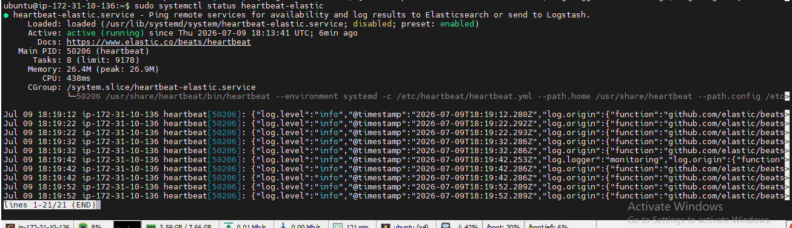
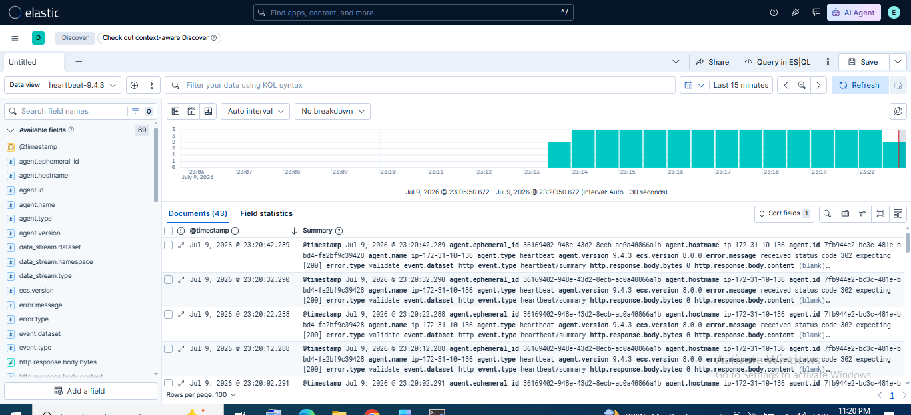

# Lab 13: Introduction to Heartbeat

## 📌 Lab Summary

In this lab, Heartbeat was installed and configured to monitor the availability of a host using ICMP (Ping). Heartbeat periodically checked the target system, sent uptime data to Elasticsearch, and the monitoring results were verified in Kibana using the Discover and Uptime applications.

---

## 🎯 Objectives

- Understand the purpose of Heartbeat.
- Install Heartbeat on Ubuntu.
- Configure an ICMP monitor.
- Send uptime data to Elasticsearch.
- Verify monitoring results in Kibana.

---

## 🛠️ Lab Environment

- Ubuntu Server (AWS EC2)
- Elasticsearch 9.x
- Kibana 9.x
- Heartbeat 9.x

---

# Step 1: Install Heartbeat

Updated the package repository and installed Heartbeat.

```bash
sudo apt update
sudo apt install heartbeat-elastic -y
```

Verified the installation.

```bash
heartbeat version
```

---

# Step 2: Configure Heartbeat

Opened the Heartbeat configuration file.

```bash
sudo nano /etc/heartbeat/heartbeat.yml
```

Configured Elasticsearch as the output destination.

```yaml
output.elasticsearch:
  hosts: ["http://localhost:9200"]
```

Configured a basic ICMP monitor.

```yaml
heartbeat.monitors:
- type: icmp
  schedule: "@every 10s"
  hosts: ["localhost"]
```

This configuration checks the availability of the localhost every 10 seconds.

---

# Step 3: Start Heartbeat

Enabled Heartbeat to start automatically.

```bash
sudo systemctl enable heartbeat-elastic
```

Started the Heartbeat service.

```bash
sudo systemctl start heartbeat-elastic
```

Verified the service status.

```bash
sudo systemctl status heartbeat-elastic
```

---

# Step 4: Verify Data in Elasticsearch

Checked whether Heartbeat created its index.

```bash
curl -X GET "localhost:9200/_cat/indices?v"
```

Expected output:

```
heartbeat-*
```

---

# Step 5: Verify Monitoring Data in Kibana

Opened **Kibana → Discover**.

Selected the **heartbeat-\*** data view.

Verified that Heartbeat was successfully sending uptime monitoring data.

Optionally, opened the **Uptime** application to view the monitored host status.

---

# Commands Used

```bash
sudo apt update
sudo apt install heartbeat-elastic -y
heartbeat version
sudo nano /etc/heartbeat/heartbeat.yml
sudo systemctl enable heartbeat-elastic
sudo systemctl start heartbeat-elastic
sudo systemctl status heartbeat-elastic
curl -X GET "localhost:9200/_cat/indices?v"
```

---

# What We Learned

- Installed Heartbeat on Ubuntu.
- Configured an ICMP monitor.
- Connected Heartbeat with Elasticsearch.
- Started and verified the Heartbeat service.
- Confirmed that Heartbeat created its index.
- Visualized uptime monitoring data in Kibana.

---

# Key Concepts

| Term | Description |
|------|-------------|
| **Heartbeat** | Elastic Beat used for uptime and availability monitoring. |
| **ICMP Monitor** | Performs ping checks to determine whether a host is reachable. |
| **Monitor** | A configured service or host that Heartbeat checks at regular intervals. |
| **Elasticsearch Output** | Sends uptime monitoring data to Elasticsearch. |
| **Uptime** | Kibana application used to monitor the health and availability of systems and services. |

---

# Screenshots

## Screenshot 1

**Heartbeat Installation and Service Status**



---

## Screenshot 2

**Heartbeat Data in Kibana Discover / Uptime**



---

# Conclusion

This lab demonstrated how to install and configure Heartbeat for uptime monitoring within the Elastic Stack. By creating an ICMP monitor, Heartbeat continuously checked the availability of a target host and sent the results to Elasticsearch. The collected monitoring data was successfully visualized in Kibana, providing real-time insight into system availability and service health.
