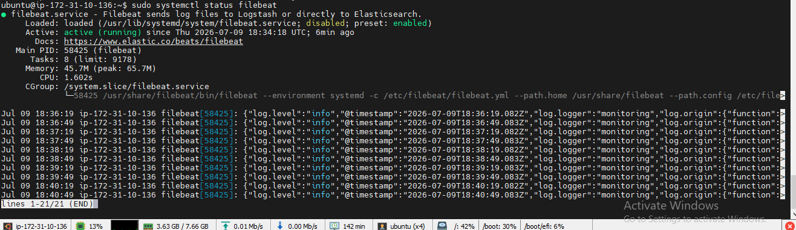
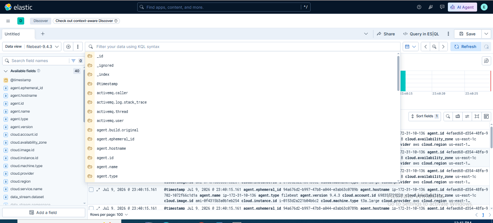

# Lab 15: Adding Syslog Data with Filebeat

## 📌 Lab Summary

In this lab, Filebeat was configured to collect Linux system logs (Syslog and Authentication logs) using the built-in **System Module**. The collected logs were forwarded to Elasticsearch and verified in Kibana Discover for searching and analysis.

---

## 🎯 Objectives

- Configure Filebeat to collect Syslog data.
- Enable the Filebeat System module.
- Validate Filebeat configuration.
- Forward Syslog events to Elasticsearch.
- Analyze Syslog data using Kibana Discover.

---

## 🛠️ Lab Environment

- Ubuntu Server (AWS EC2)
- Elasticsearch 9.x
- Kibana 9.x
- Filebeat 9.x

---

# Step 1: Enable the System Module

Navigated to the Filebeat configuration directory.

```bash
cd /etc/filebeat
```

Enabled the System module.

```bash
sudo filebeat modules enable system
```

Verified that the module was enabled successfully.

---

# Step 2: Configure the System Module

Opened the System module configuration file.

```bash
sudo nano /etc/filebeat/modules.d/system.yml
```

Configured Filebeat to collect Syslog and Authentication logs.

```yaml
- module: system
  syslog:
    enabled: true
    var.paths: ["/var/log/syslog*"]

  auth:
    enabled: true
    var.paths: ["/var/log/auth.log*"]
```

Saved the configuration file.

---

# Step 3: Validate Filebeat Configuration

Checked the configuration for syntax errors.

```bash
sudo filebeat test config
```

Successful validation confirmed that the configuration was correct.

---

# Step 4: Start Filebeat

Started the Filebeat service.

```bash
sudo systemctl start filebeat
```

Enabled Filebeat to start automatically at boot.

```bash
sudo systemctl enable filebeat
```

Verified the service status.

```bash
sudo systemctl status filebeat
```

---

# Step 5: Verify Data in Elasticsearch

Checked whether Syslog events were indexed successfully.

```bash
curl -X GET "localhost:9200/filebeat-*/_search?q=*&pretty"
```

Verified that Filebeat created the **filebeat-\*** index and Syslog events were available.

---

# Step 6: Analyze Data in Kibana

Opened **Kibana → Discover**.

Selected the **filebeat-\*** data view.

Searched for Syslog events using:

```text
system.syslog.message: "*"
```

Verified that Linux Syslog and Authentication events were successfully indexed.

---

# Commands Used

```bash
cd /etc/filebeat
sudo filebeat modules enable system
sudo nano /etc/filebeat/modules.d/system.yml
sudo filebeat test config
sudo systemctl start filebeat
sudo systemctl enable filebeat
sudo systemctl status filebeat
curl -X GET "localhost:9200/filebeat-*/_search?q=*&pretty"
```

---

# What We Learned

- Enabled the Filebeat System module.
- Configured Filebeat to collect Syslog and Authentication logs.
- Validated the Filebeat configuration.
- Started and verified the Filebeat service.
- Confirmed successful log ingestion into Elasticsearch.
- Explored Syslog events in Kibana Discover.

---

# Key Concepts

| Term | Description |
|------|-------------|
| **Filebeat** | Lightweight log shipper that collects and forwards log files. |
| **System Module** | Built-in Filebeat module for collecting Linux Syslog and Authentication logs. |
| **Syslog** | Standard Linux logging service that records system events and messages. |
| **Auth Log** | Contains authentication and login-related events. |
| **Discover** | Kibana interface used to search and analyze indexed log data. |

---

# Screenshots

## Screenshot 1

**Filebeat System Module Enabled and Service Running**



---

## Screenshot 2

**Syslog Events in Kibana Discover (filebeat-* Index)**



---

# Conclusion

This lab demonstrated how to configure Filebeat to collect Linux Syslog and Authentication logs using the System module. After validating the configuration and starting the Filebeat service, the collected logs were successfully forwarded to Elasticsearch and explored in Kibana Discover. This setup provides the foundation for centralized log collection and security monitoring within the Elastic Stack.
