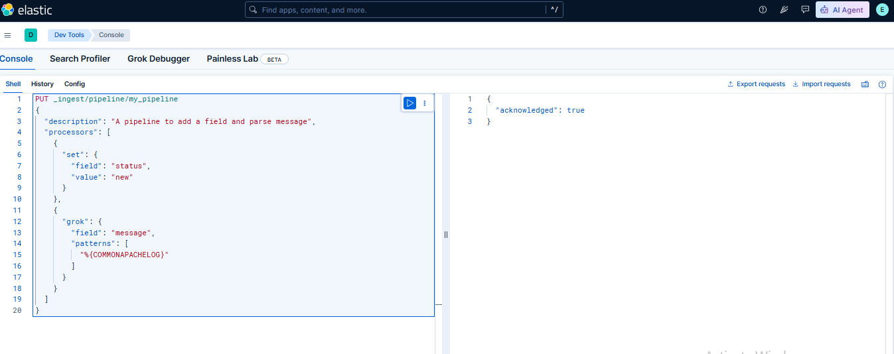
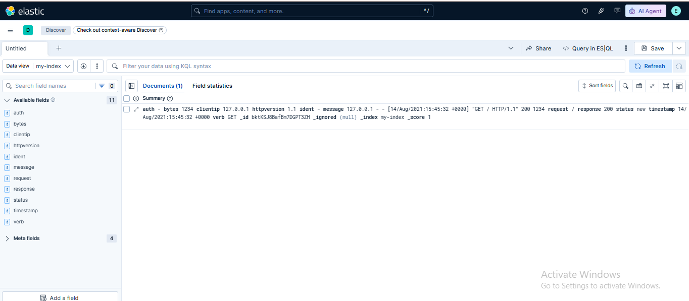

# 🧪 Lab 17: Ingest Node Pipelines

## 📌 Lab Summary

In this lab, an Elasticsearch **Ingest Node Pipeline** was created to process incoming data before indexing. A pipeline containing **Set** and **Grok** processors was configured through Kibana Dev Tools. The pipeline was then used to transform log data during indexing, and the processed documents were verified in Kibana Discover.

---

## 🎯 Objectives

- Understand the purpose of Ingest Node Pipelines.
- Create an ingest pipeline using Kibana Dev Tools.
- Configure processors to transform incoming data.
- Assign a pipeline during document ingestion.
- Verify processed data in Kibana Discover.

---

## 🛠️ Lab Environment

| Component | Details |
|-----------|----------|
| Operating System | Ubuntu 24.04 LTS |
| Elasticsearch | 9.x |
| Kibana | 9.x |
| Dev Tools | Kibana Console |
| Browser | Google Chrome |

---

# 📖 What is an Ingest Pipeline?

An **Ingest Pipeline** allows Elasticsearch to automatically process and transform documents **before they are indexed**.

Instead of modifying data manually, Elasticsearch applies processors that can:

- Add new fields
- Remove unnecessary fields
- Rename fields
- Convert field types
- Parse log messages using Grok
- Enrich documents

This makes stored data cleaner, searchable, and easier to analyze.

---

# 📚 Key Concepts

## Ingest Pipeline

A sequence of processors that executes automatically before indexing a document.

---

## Processor

A processor performs a specific task on incoming data.

Examples:

- Set
- Remove
- Rename
- Convert
- Date
- GeoIP
- Grok

---

## Set Processor

Adds a new field or updates an existing one.

Example:

```json
{
  "set": {
    "field": "status",
    "value": "new"
  }
}
```

---

## Grok Processor

Parses unstructured log messages into structured fields.

Example:

Apache Log

```
127.0.0.1 - - [14/Aug/2021:15:45:32 +0000] "GET / HTTP/1.1" 200 1234
```

After Grok parsing:

- client IP
- request
- response code
- bytes
- timestamp

become searchable fields.

---

# 📝 Lab Tasks

---

# Task 1 — Create an Ingest Pipeline

Open **Kibana → Dev Tools**

Run:

```http
PUT _ingest/pipeline/my_pipeline
{
  "description": "A pipeline to add a field and parse message",
  "processors": [
    {
      "set": {
        "field": "status",
        "value": "new"
      }
    },
    {
      "grok": {
        "field": "message",
        "patterns": [
          "%{COMMONAPACHELOG}"
        ]
      }
    }
  ]
}
```

---

### Explanation

The pipeline performs two operations:

1. Adds a new field:

```
status = new
```

2. Parses Apache log messages into structured fields.

---

📷 **Screenshot 1**

```
Creating Ingest Pipeline in Kibana Dev Tools

```

---

# Task 2 — Use Pipeline During Indexing

Instead of indexing normally, specify the pipeline.

Run:

```http
POST my-index/_doc?pipeline=my_pipeline
{
  "message": "127.0.0.1 - - [14/Aug/2021:15:45:32 +0000] \"GET / HTTP/1.1\" 200 1234"
}
```

---

### What Happens?

Before Elasticsearch stores the document:

- Set processor runs
- Grok processor parses the log
- Processed document is indexed

---

# Alternative Method (Using Filebeat)

Configure Filebeat output:

```yaml
output.elasticsearch:
  hosts: ["https://localhost:9200"]
  pipeline: "my_pipeline"
```

Restart Filebeat:

```bash
sudo systemctl restart filebeat
```

Now every event sent by Filebeat passes through the ingest pipeline.

---

# Task 3 — Verify the Pipeline

Open:

```
Kibana
```

↓

```
Discover
```

↓

Select:

```
my-index
```

Search the indexed document.

You should see:

- status
- clientip
- request
- response
- bytes
- timestamp

instead of only the original message.

---

📷 **Screenshot 2**

```
Processed Document in Kibana Discover Showing Parsed Fields

```

---

# Example Output

Before Pipeline

```json
{
  "message": "127.0.0.1 GET /index.html"
}
```

After Pipeline

```json
{
  "message": "...",
  "status": "new",
  "clientip": "127.0.0.1",
  "verb": "GET",
  "request": "/index.html",
  "response": 200
}
```

---

# Verification Commands

List pipelines:

```http
GET _ingest/pipeline
```

View a specific pipeline:

```http
GET _ingest/pipeline/my_pipeline
```

Simulate a pipeline without indexing:

```http
POST _ingest/pipeline/my_pipeline/_simulate
{
  "docs": [
    {
      "_source": {
        "message": "127.0.0.1 - - [14/Aug/2021:15:45:32 +0000] \"GET / HTTP/1.1\" 200 1234"
      }
    }
  ]
}
```

---

# Lab Outcome

After completing this lab, I successfully:

- Created an Elasticsearch Ingest Pipeline.
- Configured Set and Grok processors.
- Parsed Apache log data into structured fields.
- Indexed documents through the pipeline.
- Verified transformed data in Kibana Discover.
- Learned how ingest pipelines preprocess data before indexing.

---

# Key Takeaways

- Ingest Pipelines preprocess documents before indexing.
- Processors automate data transformation.
- Grok converts unstructured logs into searchable fields.
- Set processor enriches documents with additional information.
- Pipelines improve searchability and simplify analytics.
- Filebeat can automatically send logs through an ingest pipeline.

---

# 📷 Screenshots

### Screenshot 1

**Creating Ingest Pipeline in Kibana Dev Tools**

> *(Insert screenshot here)*

---

### Screenshot 2

**Processed Document Verified in Kibana Discover**

> *(Insert screenshot here)*

---

# 🏁 Conclusion

This lab demonstrated how **Elasticsearch Ingest Node Pipelines** can automatically transform incoming data before indexing. By using **Set** and **Grok** processors, raw log messages were enriched and converted into structured fields, making them easier to search, analyze, and visualize in Kibana. Ingest pipelines are a powerful feature for implementing centralized data processing without requiring external tools like Logstash for simple transformations.
