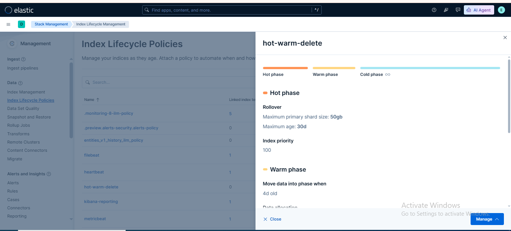
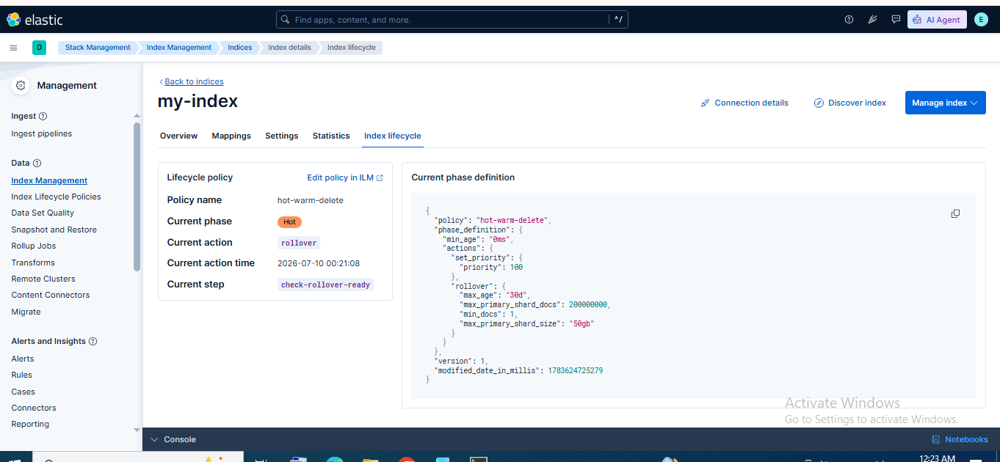

# 🧪 Lab 18: Index Lifecycle Management (ILM)

## 📌 Lab Summary

In this lab, I explored **Index Lifecycle Management (ILM)** in Elasticsearch. An ILM policy was created in Kibana to automate index management by defining lifecycle phases such as **Hot**, **Warm**, and **Delete**. The policy was then applied to a test index, and the lifecycle status was verified through Kibana's Index Management interface.

---

## 🎯 Objectives

- Understand the concept of Index Lifecycle Management (ILM).
- Learn how to create an ILM policy in Kibana.
- Apply an ILM policy to an Elasticsearch index.
- Monitor index lifecycle transitions.
- Understand how ILM optimizes storage and retention.

---

## 🛠️ Lab Environment

| Component | Details |
|-----------|----------|
| Operating System | Ubuntu 24.04 LTS |
| Elasticsearch | 9.x |
| Kibana | 9.x |
| Browser | Google Chrome |
| Feature Used | Index Lifecycle Management (ILM) |

---

# 📖 What is Index Lifecycle Management (ILM)?

**Index Lifecycle Management (ILM)** is an Elasticsearch feature that automatically manages the lifecycle of indices based on predefined policies.

Instead of manually deleting or moving old indices, ILM performs these operations automatically according to configured lifecycle phases.

ILM helps:

- Reduce storage costs
- Improve cluster performance
- Automate data retention
- Manage index aging
- Simplify administration

---

# 📚 ILM Lifecycle Phases

## 🔥 Hot Phase

The Hot phase stores actively written and frequently searched data.

Typical actions:

- Indexing new documents
- Rollover
- Set Priority

---

## 🌤 Warm Phase

The Warm phase stores data that is searched occasionally but no longer receives new writes.

Typical actions:

- Shrink index
- Force Merge
- Allocate to Warm Nodes

---

## ❄ Cold Phase

The Cold phase stores infrequently accessed data.

Typical actions:

- Move to low-cost storage
- Read-only mode

---

## 🧊 Frozen Phase

The Frozen phase is used for archived data with very infrequent access.

This phase minimizes storage costs.

---

## 🗑 Delete Phase

The Delete phase permanently removes indices after the configured retention period.

Example:

```
Delete after 7 days
```

---

# 📝 Lab Tasks

---

# Task 1 — Create an ILM Policy

Open Kibana.

Navigate to:

```
Stack Management
```

↓

```
Index Lifecycle Policies
```

↓

Click

```
Create Policy
```

Provide a policy name:

```
hot-warm-delete
```

---

## Configure Lifecycle Phases

### Hot Phase

Leave the default settings.

---

### Warm Phase

Enable the Warm phase.

(Optional)

Configure migration to Warm Nodes if available.

---

### Delete Phase

Enable the Delete phase.

Configure:

```
Delete after: 7 Days
```

Click

```
Save Policy
```

---

📷 **Screenshot 1**


## Creating ILM Policy in Kibana


---

# Task 2 — Apply ILM Policy

Navigate to

```
Stack Management
```

↓

```
Index Management
```

Select the test index.

Example:

```
test-index-001
```

Click

```
Manage ILM Policy
```

Choose

```
hot-warm-delete
```

Apply the policy.

---

# Task 3 — Verify ILM Status

Return to

```
Stack Management
```

↓

```
Index Lifecycle Policies
```

Open the policy details.

Verify:

- Current phase
- Current action
- Lifecycle history
- Policy assignment

Ensure the index is managed by the newly created ILM policy.

---

📷 **Screenshot 2**


## ILM Policy Applied to Test Index


---

# Example ILM Policy

```json
PUT _ilm/policy/hot-warm-delete
{
  "policy": {
    "phases": {
      "hot": {
        "actions": {}
      },
      "warm": {
        "actions": {}
      },
      "delete": {
        "min_age": "7d",
        "actions": {
          "delete": {}
        }
      }
    }
  }
}
```

---

# Verify ILM Policy

List all policies:

```http
GET _ilm/policy
```

View a specific policy:

```http
GET _ilm/policy/hot-warm-delete
```

Check index lifecycle status:

```http
GET test-index-001/_ilm/explain
```

---

# Benefits of ILM

- Automatic index management
- Reduces manual administration
- Optimizes storage usage
- Improves cluster performance
- Automates data retention
- Supports compliance requirements
- Prevents unnecessary storage growth

---

# Real-World Use Cases

### Log Management

Automatically delete logs older than 30 days.

---

### Security Monitoring

Retain security logs for one year and archive older data.

---

### Application Monitoring

Keep recent application logs on fast storage while moving older logs to cheaper storage.

---

### Compliance

Automatically remove expired records according to organizational retention policies.

---

# Lab Outcome

After completing this lab, I successfully:

- Created an Index Lifecycle Management policy.
- Configured Hot, Warm, and Delete phases.
- Applied the policy to a test index.
- Verified lifecycle status in Kibana.
- Learned how Elasticsearch automates index retention and storage management.

---

# Key Takeaways

- ILM automates index lifecycle management.
- Policies reduce manual maintenance.
- Hot phase stores active data.
- Warm phase optimizes older data.
- Delete phase removes expired indices automatically.
- ILM helps improve cluster performance while reducing storage costs.

---

# 📸 Screenshots

### Screenshot 1

**Creating an ILM Policy in Kibana**

> *(Insert screenshot here)*

---

### Screenshot 2

**ILM Policy Successfully Applied to the Test Index**

> *(Insert screenshot here)*

---

# 🏁 Conclusion

This lab introduced the fundamentals of **Index Lifecycle Management (ILM)** in Elasticsearch. By creating and applying an ILM policy, index lifecycle operations such as retention and deletion were automated, reducing administrative overhead and improving storage efficiency. ILM is an essential feature for managing large-scale Elasticsearch deployments, ensuring that data is retained only for the required period while optimizing cluster performance.
