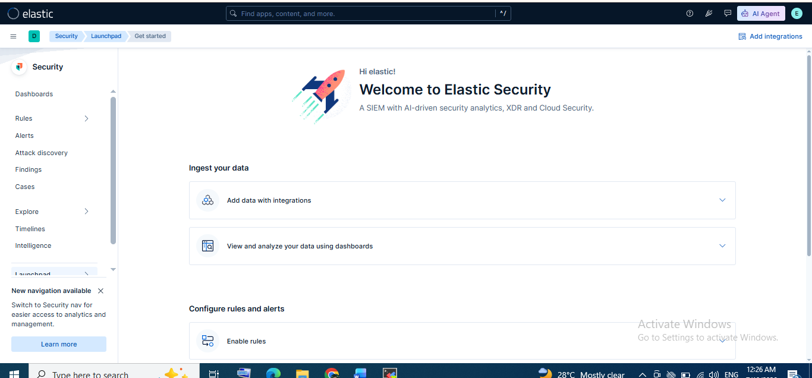
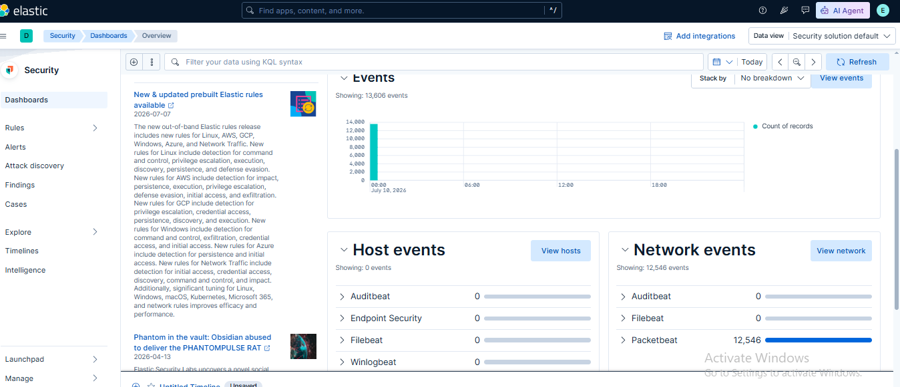

# 🛡️ Lab 19: Introduction to Elastic Security (SIEM) App

## 📌 Lab Summary

In this lab, the **Elastic Security (SIEM)** application in Kibana was explored to understand its role in modern Security Operations Centers (SOCs). The lab focused on navigating the Security interface, analyzing hosts and network activity, creating investigation timelines, and using Kibana Query Language (KQL) to filter security events.

---

## 🎯 Objectives

- Understand the purpose of the Elastic Security (SIEM) application.
- Navigate the Hosts, Network, and Timelines sections.
- Analyze security-related events and host activity.
- Create investigation timelines for incident analysis.
- Apply KQL filters to search and investigate events.
- Save customized views for future investigations.

---

## 🛠️ Lab Environment

| Component | Details |
|-----------|---------|
| SIEM Platform | Elastic Security |
| Elasticsearch | 9.x |
| Kibana | 9.x |
| Operating System | Ubuntu 24.04 LTS |
| Browser | Google Chrome |
| Data Source | Filebeat, Metricbeat, Packetbeat, Heartbeat |

---

# 📖 What is Elastic Security?

Elastic Security is the SIEM solution within the Elastic Stack that provides centralized visibility into security events collected from multiple sources. It combines log management, endpoint monitoring, threat detection, dashboards, and investigation tools into a single interface.

It enables analysts to:

- Monitor hosts
- Analyze network traffic
- Investigate security incidents
- Create timelines
- Detect suspicious activities
- Search events using KQL

---

# 📂 Lab Tasks

## Task 1: Access Elastic Security

The Security application was opened from the Kibana sidebar.

Navigation:

```
Kibana
    └── Security
```

This launches the Elastic Security dashboard.

---

### Screenshot 1

## The Elastic Security Home page.*



---

## Task 2: Explore the Hosts View

The **Hosts** section was used to analyze endpoint information collected from connected systems.

Information observed included:

- Host Name
- Operating System
- CPU Usage
- Memory Usage
- Authentication Events
- Host Alerts
- Running Processes

This view provides an overview of endpoint activity and health.

---

## Task 3: Explore the Network View

The **Network** tab was used to inspect network-related events.

Key information available includes:

- Source IP
- Destination IP
- Protocol
- Network Connections
- Inbound Traffic
- Outbound Traffic
- DNS Activity
- HTTP Requests

This helps analysts detect suspicious communications and abnormal traffic patterns.

---

## Task 4: Create an Investigation Timeline

The **Timelines** feature was explored for incident investigation.

Activities performed:

- Created a new Timeline
- Added event data
- Added filters
- Reviewed host activities
- Correlated security events

Timelines allow analysts to organize evidence during investigations.

---

### Screenshot 2

## Hosts-Overview



---

## Task 5: Use Kibana Query Language (KQL)

KQL was used to filter security events.

Example query:

```kql
host.name: "your-host-name" AND event.action: "login"
```

Other useful examples:

```kql
event.category : process
```

```kql
event.category : network
```

```kql
event.outcome : failure
```

```kql
host.name : *
```

KQL enables quick searching and filtering of large volumes of security events.

---

# 🔍 Key Concepts

## Elastic Security

A SIEM platform used for threat detection, investigation, monitoring, and incident response.

---

## Hosts

Displays endpoint information including:

- System activity
- Authentication logs
- Running processes
- Alerts
- Host health

---

## Network

Provides visibility into:

- Connections
- DNS queries
- HTTP traffic
- IP communications
- Network anomalies

---

## Timelines

An investigation workspace that allows analysts to:

- Collect evidence
- Correlate events
- Build incident timelines
- Analyze attacks

---

## KQL (Kibana Query Language)

A simple search language used for filtering Elasticsearch documents inside Kibana.

Example:

```kql
event.category : process
```

---

# 💡 Use Cases

Elastic Security can be used to:

- Detect brute-force attacks
- Monitor failed logins
- Identify malware activity
- Investigate suspicious network traffic
- Analyze endpoint events
- Hunt threats across multiple hosts
- Correlate security logs from different data sources

---

# 📊 Outcome

After completing this lab, the following skills were achieved:

- Accessed the Elastic Security application.
- Explored Hosts and Network monitoring dashboards.
- Created investigation timelines.
- Used Kibana Query Language (KQL).
- Learned how security analysts investigate events using Elastic SIEM.

---

# ✅ Conclusion

This lab introduced the **Elastic Security (SIEM)** application and demonstrated its core investigation capabilities. By exploring Hosts, Network, and Timelines, users gained practical experience in monitoring endpoint activity, analyzing network events, and conducting basic security investigations. These features form the foundation of Security Operations Center (SOC) workflows and prepare users for advanced threat hunting and incident response.

---

# 📚 Key Takeaways

- Elastic Security centralizes security monitoring.
- Hosts view provides endpoint visibility.
- Network view helps identify suspicious communications.
- Timelines support incident investigations.
- KQL simplifies searching and filtering security events.
- Elastic SIEM is a powerful platform for SOC analysts.

---

