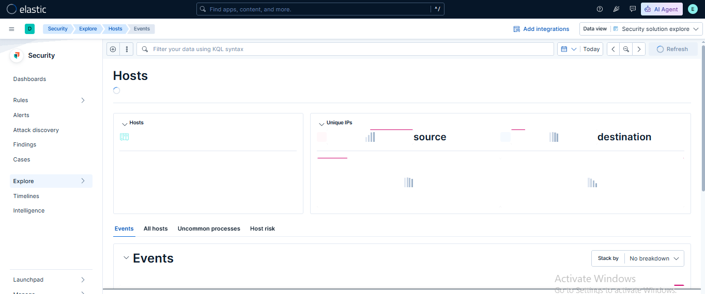

# 🛡️ Lab 20: Host Overview in Elastic Security

## 📌 Lab Summary

In this lab, the **Host Overview** feature of **Elastic Security** was explored to monitor endpoint activities and investigate host-specific events. The lab demonstrated how to access host details, analyze processes, review user logins and network activity, apply filters using Kibana Query Language (KQL), and save frequently used queries for future investigations.

---

## 🎯 Objectives

- Understand the Host Overview feature in Elastic Security.
- Navigate host-related events and activities.
- Filter events by user or process.
- Save and reuse filters and queries.
- Analyze endpoint activity for security investigations.

---

## 🛠️ Lab Environment

| Component | Details |
|-----------|---------|
| SIEM Platform | Elastic Security |
| Elasticsearch | 9.x |
| Kibana | 9.x |
| Operating System | Ubuntu 24.04 LTS |
| Browser | Google Chrome |
| Data Sources | Filebeat, Metricbeat, Packetbeat, Heartbeat |

---

# 📖 What is Host Overview?

The **Host Overview** page provides detailed visibility into an endpoint's activity. It helps SOC analysts investigate a specific host by displaying information such as:

- Active Processes
- Logged-in Users
- Network Connections
- Alerts
- Authentication Events
- File Activity
- Endpoint Metrics

This centralized view simplifies threat hunting and incident investigation.

---

# 📂 Lab Tasks

## Task 1: Access the Hosts Section

The Hosts section was accessed from the Elastic Security application.

Navigation:

```
Kibana
    └── Security
            └── Hosts
```

This page displays all monitored systems connected to Elasticsearch.

---

### 📷 Screenshot 1

## Hosts Page


---

## Task 2: Open a Host Overview

A specific host was selected from the Hosts list to view detailed information.

The Host Overview page displayed:

- Host Information
- Operating System
- CPU Usage
- Memory Usage
- Active Users
- Running Processes
- Network Connections
- Alerts
- Recent Events

This view provides a complete picture of endpoint activity.

---

## Task 3: Filter Events by User or Process

The **Events** section was used to search for specific activities.

Example KQL query for filtering a user:

```kql
user.name : "target_user"
```

Example KQL query for filtering a process:

```kql
process.name : "target_process"
```

Additional useful filters:

```kql
event.category : process
```

```kql
event.action : login
```

```kql
host.name : "hostname"
```

These filters help narrow investigation results to relevant security events.

---

## Task 4: Save a Query or Filter

After creating a useful filter:

- Clicked **Save**
- Entered a name
- Added an optional description
- Saved the query

Saved queries can later be loaded for faster investigations.

---


# 🔍 Key Concepts

## Host Overview

Provides complete visibility into endpoint activity including:

- User logins
- Running processes
- Alerts
- Network activity
- Authentication events
- Security events

---

## Event Filtering

Filtering allows analysts to quickly locate relevant events using KQL.

Example:

```kql
user.name : "elastic"
```

---

## Process Monitoring

Tracks running applications and services to detect suspicious or unauthorized processes.

Example:

```kql
process.name : "bash"
```

---

## Saved Queries

Frequently used searches can be stored and reused without recreating filters.

Benefits include:

- Faster investigations
- Consistent analysis
- Improved SOC workflows

---

# 💡 Use Cases

Host Overview is commonly used for:

- Investigating suspicious user logins
- Detecting malicious processes
- Monitoring endpoint activity
- Investigating malware infections
- Reviewing authentication failures
- Threat hunting
- Incident response

---

# 📊 Outcome

After completing this lab, the following skills were achieved:

- Accessed the Hosts section in Elastic Security.
- Viewed detailed endpoint information.
- Investigated host events and processes.
- Filtered events using KQL.
- Saved reusable filters for future investigations.

---

# ✅ Conclusion

This lab introduced the **Host Overview** feature in Elastic Security and demonstrated how security analysts investigate endpoint activities. By exploring host details, filtering events, and saving queries, users gained practical experience in endpoint monitoring and incident investigation. These capabilities are essential for efficient threat hunting and SOC operations.

---

# 📚 Key Takeaways

- Host Overview provides centralized endpoint visibility.
- KQL enables powerful event filtering.
- Process monitoring helps detect suspicious activity.
- Saved queries improve investigation efficiency.
- Host analysis is a core SOC analyst responsibility.

---


