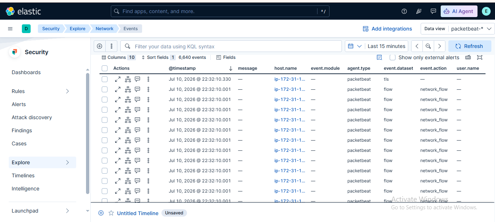

# 🌐 Lab 21: Network Overview in Elastic Security

## 📌 Lab Summary

In this lab, the **Network Overview** feature of **Elastic Security** was explored to monitor network communications using **Packetbeat**. The lab demonstrated how to view inbound and outbound connections, filter network traffic by IP address or port, and identify suspicious network activity through Kibana.

---

## 🎯 Objectives

- Understand the Network Overview feature in Elastic Security.
- Monitor inbound and outbound connections using Packetbeat.
- Filter network traffic by IP address and port.
- Identify suspicious or unexpected network connections.
- Analyze network events using Kibana.

---

## 🛠️ Lab Environment

| Component | Details |
|-----------|---------|
| SIEM Platform | Elastic Security |
| Elasticsearch | 9.x |
| Kibana | 9.x |
| Packetbeat | 9.x |
| Operating System | Ubuntu 24.04 LTS |
| Browser | Google Chrome |

---

# 📖 What is Network Overview?

The **Network Overview** page in Elastic Security provides visibility into network activity across monitored systems.

It enables analysts to monitor:

- Inbound connections
- Outbound connections
- Source and destination IP addresses
- Network protocols
- Ports
- DNS traffic
- HTTP requests
- Network anomalies

This information helps identify suspicious communications and potential security threats.

---

# 📂 Lab Tasks

## Task 1: Monitor Network Traffic with Packetbeat

Packetbeat was configured to capture network traffic and forward events to Elasticsearch.

Configuration example:

```yaml
packetbeat.interfaces.device: any

packetbeat.flows:
  timeout: 30s
  period: 10s
```

Packetbeat service was started:

```bash
sudo systemctl start packetbeat
```

After Packetbeat began collecting traffic, Kibana displayed inbound and outbound network events.

---

## Task 2: Analyze Network Events

Inside **Elastic Security → Network**, the captured traffic was reviewed.

The following information was analyzed:

- Source IP
- Destination IP
- Source Port
- Destination Port
- Network Protocol
- Event Time
- Bytes Sent
- Bytes Received

These details help analysts understand communication between systems.

---

## Task 3: Filter Network Traffic

Traffic was filtered using Kibana Query Language (KQL).

Filter by IP address:

```kql
source.ip : "192.168.1.1"
```

Filter by destination IP:

```kql
destination.ip : "192.168.1.10"
```

Filter by port:

```kql
destination.port : 80
```

Filter by protocol:

```kql
network.transport : tcp
```

Saved filters can later be reused for faster investigations.

---

## Task 4: Identify Suspicious Connections

Network events were reviewed to detect unusual activity.

Examples include:

- Unknown external IP addresses
- Unexpected outbound connections
- Unusual destination ports
- Excessive network traffic
- Repeated connection attempts

These observations help detect potential attacks such as:

- Port scanning
- Data exfiltration
- Malware communication
- Command-and-Control (C2) traffic

---

## 📷 Screenshot

## Network Overview

---

# 🔍 Key Concepts

## Packetbeat

A lightweight Elastic Beat used to capture and analyze real-time network traffic.

---

## Network Overview

Provides centralized visibility into:

- IP communications
- Network sessions
- Protocols
- Connections
- Traffic statistics

---

## KQL (Kibana Query Language)

Used to search and filter network events.

Example:

```kql
destination.port : 443
```

---

## Network Monitoring

Helps identify:

- Unauthorized communications
- Suspicious IP addresses
- Unusual traffic patterns
- Potential attacks

---

# 💡 Use Cases

Network Overview can be used to:

- Detect port scanning
- Monitor inbound and outbound traffic
- Investigate suspicious IP addresses
- Analyze DNS activity
- Detect malware communications
- Perform threat hunting
- Support incident response investigations

---

# 📊 Outcome

After completing this lab, the following skills were achieved:

- Monitored network traffic using Packetbeat.
- Explored the Network Overview page in Elastic Security.
- Filtered events by IP address and port.
- Investigated suspicious network connections.
- Used KQL for network analysis.

---

# ✅ Conclusion

This lab introduced the **Network Overview** feature in Elastic Security and demonstrated how Packetbeat provides visibility into network communications. By filtering traffic, reviewing connection details, and identifying unusual network behavior, users gained practical experience in network monitoring and threat detection. These skills are fundamental for SOC analysts responsible for detecting and investigating network-based attacks.

---

# 📚 Key Takeaways

- Packetbeat captures real-time network traffic.
- Network Overview provides complete visibility into communications.
- KQL enables fast filtering of network events.
- Monitoring IP addresses and ports helps identify threats.
- Network analysis is an essential SOC analyst skill.

---

