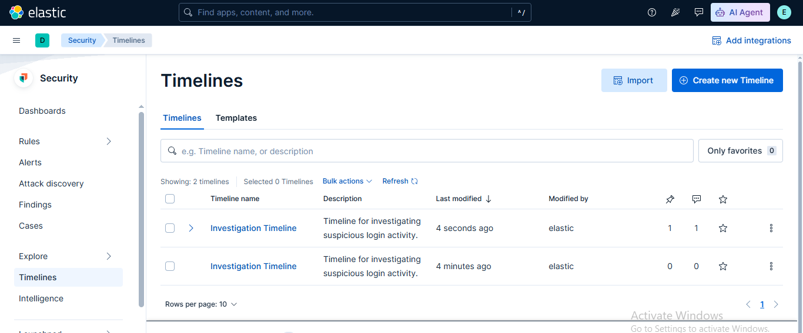

# 🕒 Lab 22: Building Timelines for Investigations

## 📌 Lab Summary

In this lab, the **Timeline** feature of **Elastic Security** was used to organize and investigate security events. A new investigation timeline was created, relevant events were added, notes and tags were applied, and Kibana Query Language (KQL) filters were used to narrow down results. Timelines provide security analysts with a structured workspace for incident investigation and event correlation.

---

## 🎯 Objectives

- Understand the purpose of Timelines in Elastic Security.
- Create a new investigation timeline.
- Add security events to a timeline.
- Organize investigations using notes and tags.
- Filter events using Kibana Query Language (KQL).
- Save timelines for future investigations.

---

## 🛠️ Lab Environment

| Component | Details |
|-----------|---------|
| SIEM Platform | Elastic Security |
| Elasticsearch | 9.x |
| Kibana | 9.x |
| Operating System | Ubuntu 24.04 LTS |
| Browser | Google Chrome |

---

# 📖 Introduction

Timelines are one of the most useful investigation tools available in Elastic Security. They allow analysts to collect related security events into a single workspace, making it easier to investigate suspicious activity, correlate events, and document findings during an incident response process.

---

# 📂 Lab Tasks

## Task 1: Access the Timeline Feature

Open Kibana and navigate to:

```
Security
    └── Investigations
            └── Timelines
```

The Timelines page displays previously saved investigations and allows creation of new timelines.

---

## Task 2: Create a New Timeline

A new investigation timeline was created.

Example:

- **Name:** Investigation Timeline
- **Description:** Timeline for investigating suspicious login activity.

After entering the required information, the timeline was saved.

---

## Task 3: Add Events to the Timeline

Security events from Elastic Security were added to the timeline.

Examples include:

- Authentication events
- Process execution events
- Network connection events

These events help analysts reconstruct the sequence of activities during an investigation.

---

## Task 4: Add Notes and Tags

Notes were attached to important events for documentation.

Example note:

```
Suspicious login observed from an unknown IP address.
Further investigation required.
```

Tags were also added to organize the investigation.

Example tags:

- Investigation
- Suspicious Login
- SOC Lab

---

## Task 5: Filter Events

Kibana Query Language (KQL) was used to filter timeline events.

Example:

```kql
event.category : authentication
```

Other useful queries:

```kql
event.outcome : failure
```

```kql
host.name : "ubuntu-server"
```

```kql
process.name : "bash"
```

Filtering helps investigators quickly focus on relevant events.

---

## Task 6: Save the Timeline

After completing the investigation, the timeline was saved for future use.

Saved timelines allow analysts to:

- Continue investigations later
- Share findings with team members
- Reuse investigation workflows

---

# 🔍 Key Concepts

## Timeline

An investigation workspace used to collect, correlate, and analyze security events.

---

## Event Correlation

The process of connecting multiple related events to understand an incident.

---

## Notes

Annotations added to timeline events to document observations and findings.

---

## Tags

Labels used to categorize and organize investigations.

---

## KQL (Kibana Query Language)

A search language used for filtering and querying security events.

Example:

```kql
event.category : authentication
```

---

# 💡 Use Cases

Timelines are commonly used for:

- Investigating failed login attempts
- Malware analysis
- Insider threat investigations
- Network intrusion analysis
- Threat hunting
- Incident response
- Security event correlation

---

# 📊 Outcome

After completing this lab, the following skills were achieved:

- Accessed the Timeline feature in Elastic Security.
- Created a new investigation timeline.
- Added security events for analysis.
- Applied notes and tags to organize findings.
- Filtered events using KQL.
- Saved the investigation timeline for future use.

---

## 📷 Screenshot

## Investigation Timeline 



---

# ✅ Conclusion

This lab demonstrated how Elastic Security Timelines simplify security investigations by providing a centralized workspace for collecting, organizing, and analyzing security events. By creating timelines, applying filters, and documenting findings with notes and tags, analysts can investigate incidents more efficiently and maintain a clear record of their investigative process.

---

# 📚 Key Takeaways

- Timelines provide a structured investigation workspace.
- Multiple security events can be correlated in one place.
- KQL enables fast and flexible event filtering.
- Notes and tags improve investigation documentation.
- Saved timelines support collaborative incident response.

---

