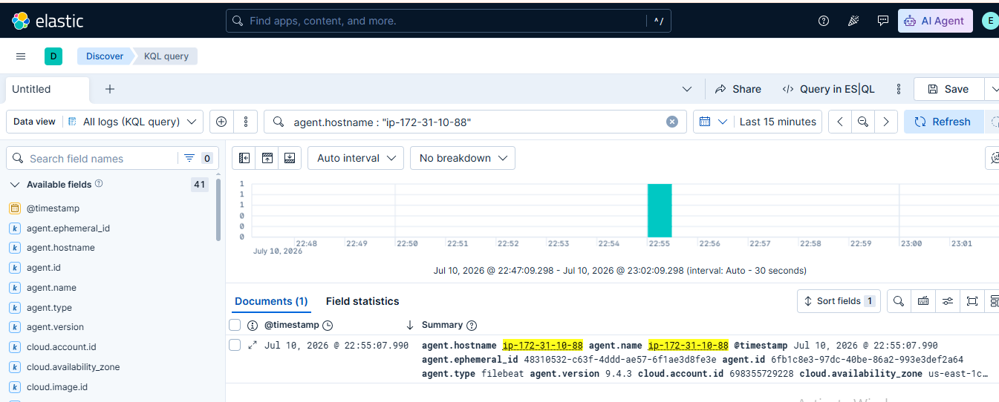

# 🛡️ Lab 23: Threat Hunting with Basic KQL Queries

## 📌 Lab Summary

In this lab, **Kibana Query Language (KQL)** was used within **Elastic Security** to perform basic threat hunting activities. Different KQL queries were executed to identify authentication events, failed logins, process executions, network activity, and host-specific events. The lab also demonstrated how to filter events using time ranges, save reusable queries, and export search results for further analysis.

---

## 🎯 Objectives

- Understand the fundamentals of Kibana Query Language (KQL).
- Perform basic threat hunting using Elastic Security.
- Search for authentication and process events.
- Filter events by host, IP address, and time range.
- Save reusable KQL queries.
- Export search results for reporting and investigation.

---

## 🛠️ Lab Environment

| Component | Details |
|-----------|---------|
| SIEM Platform | Elastic Security |
| Elasticsearch | 9.x |
| Kibana | 9.x |
| Operating System | Ubuntu 24.04 LTS |
| Browser | Google Chrome |

---

# 📖 Introduction

Threat hunting is a proactive cybersecurity practice that involves searching for suspicious or malicious activities within an environment before automated alerts are triggered. Elastic Security provides powerful hunting capabilities through **Kibana Query Language (KQL)**, allowing analysts to quickly search, filter, and investigate security events stored in Elasticsearch.

---

# 📂 Lab Tasks

## Task 1: Open Elastic Security

Open Kibana and navigate to:

```
Security
    └── Explore
            ├── Hosts
            ├── Network
            └── Discover
```

The Discover page provides access to indexed security events and supports KQL-based searches.

---

## Task 2: Search Authentication Events

Search all authentication-related events using the following KQL query:

```kql
event.category : authentication
```

Review authentication logs and verify user login activity.

---

## Task 3: Identify Failed Login Attempts

Search for failed authentication events:

```kql
event.outcome : failure
```

This query helps identify unsuccessful login attempts that may indicate brute-force attacks or unauthorized access attempts.

---

## Task 4: Search Process Execution Events

Search for Bash process executions:

```kql
process.name : "bash"
```

Additional examples:

```kql
process.name : "sshd"
```

```kql
process.name : "sudo"
```

These queries help monitor command execution and privileged activities.

---

## Task 5: Filter Network Activity

Search network-related events:

```kql
event.category : network
```

Filter traffic by destination port:

```kql
destination.port : 22
```

Search events containing source IP addresses:

```kql
source.ip : *
```

These queries assist in monitoring inbound and outbound network connections.

---

## Task 6: Filter Events by Host

Search events generated by a specific host:

```kql
host.name : "ubuntu-server"
```

Replace the hostname with your own system if necessary.

---

## Task 7: Apply Time Filters

Use Kibana's Time Picker to limit search results.

Examples:

- Last 15 Minutes
- Last 24 Hours
- Last 7 Days

Time-based filtering helps investigators focus on recent security events.

---

## Task 8: Save a KQL Query

After creating a useful search, click **Save Query**.

Example:

**Query Name**

```
Failed Login Hunt
```

Saved queries can be reused during future investigations.

---

## Task 9: Export Search Results

From the Discover page:

```
Share
    └── Export CSV
```

Exported results can be used for documentation, reporting, or incident investigations.

---

# 🔍 Common KQL Queries

## Authentication Events

```kql
event.category : authentication
```

---

## Failed Login Events

```kql
event.outcome : failure
```

---

## Successful Logins

```kql
event.outcome : success
```

---

## Bash Process Activity

```kql
process.name : "bash"
```

---

## SSH Activity

```kql
process.name : "sshd"
```

---

## Network Events

```kql
event.category : network
```

---

## Source IP Address

```kql
source.ip : *
```

---

## Destination Port

```kql
destination.port : 22
```

---

## Specific Host

```kql
host.name : "ubuntu-server"
```

---

# 🔍 Key Concepts

## Threat Hunting

A proactive approach to identifying hidden threats by analyzing logs and security events.

---

## Kibana Query Language (KQL)

A simple query language used in Kibana to search and filter indexed data.

---

## Authentication Events

Events related to user login attempts and authentication activities.

---

## Process Events

Logs generated when processes or commands are executed on a system.

---

## Network Events

Logs containing inbound and outbound network communications.

---

## Time Filtering

Restricting search results to a selected time window for focused analysis.

---

# 💡 Use Cases

KQL can be used to investigate:

- Failed login attempts
- SSH activity
- Privilege escalation
- Suspicious process execution
- Network connections
- Threat hunting
- Incident response
- User activity monitoring

---

# 📊 Outcome

After completing this lab, the following tasks were successfully performed:

- Accessed Elastic Security Discover.
- Executed KQL queries to search security events.
- Identified authentication and failed login events.
- Investigated process execution activities.
- Filtered network events by IP and port.
- Applied host and time-based filters.
- Saved reusable KQL queries.
- Exported search results for reporting.

---

## 📷 Screenshot

## Kibana Discover showing KQL query execution and search results.

---

# ✅ Conclusion

This lab demonstrated how Kibana Query Language (KQL) can be used within Elastic Security to perform basic threat hunting activities. By searching authentication events, monitoring process execution, filtering network traffic, and applying host and time-based filters, security analysts can quickly identify suspicious behavior and investigate potential security incidents. These foundational KQL skills are essential for effective SOC operations and proactive threat hunting.

---

# 📚 Key Takeaways

- KQL enables fast and efficient log searching.
- Authentication events help detect unauthorized access attempts.
- Process monitoring improves endpoint visibility.
- Network filtering supports threat investigation.
- Saved queries improve investigation efficiency.
- Time filters simplify event analysis.
- KQL is a core skill for SOC analysts and threat hunters.

---
