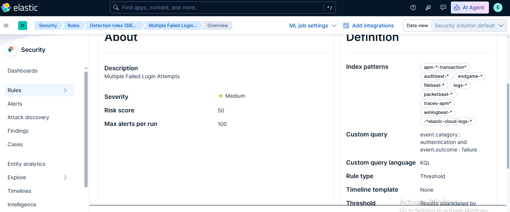

# 🛡️ Lab 25: Custom Detection Rules

## 📌 Lab Summary

In this lab, a **Custom Detection Rule** was created in **Elastic Security** to detect repeated failed login attempts within a specified time window. The rule was configured with an appropriate severity level and risk score, then tested by simulating failed authentication events. Finally, generated alerts were reviewed in Kibana to verify that the rule functioned as expected.

---

## 🎯 Objectives

- Understand the purpose of custom detection rules.
- Create a custom detection rule in Elastic Security.
- Detect repeated failed login attempts.
- Configure rule severity and risk score.
- Test the rule using simulated authentication failures.
- Verify alerts generated by the rule.

---

## 🛠️ Lab Environment

| Component | Details |
|-----------|---------|
| SIEM Platform | Elastic Security |
| Elasticsearch | 9.x |
| Kibana | 9.x |
| Operating System | Ubuntu 24.04 LTS |
| Browser | Google Chrome |

---

# 📖 Introduction

While Elastic Security includes hundreds of prebuilt detection rules, organizations often need to detect behaviors unique to their own environments. **Custom Detection Rules** allow security analysts to define their own logic using KQL, EQL, Threshold, Machine Learning, or ES|QL rules.

In this lab, a custom rule was created to identify multiple failed login attempts occurring within a short period, a common indicator of brute-force attacks.

---

# 📂 Lab Tasks

## Task 1: Open the Detection Rules Page

Open Kibana and navigate to:

```
Security
    └── Rules
```

The Rules page displays all existing detection rules and provides an option to create new custom rules.

---

## Task 2: Create a New Detection Rule

Click:

```
Create Rule
```

Select the rule type:

```
Threshold Rule
```

*(You may also use a Custom Query Rule depending on your Elastic version.)*

---

## Task 3: Configure the Detection Logic

Use the following KQL query to detect failed authentication events:

```kql
event.category : authentication and event.outcome : failure
```

Configure the threshold:

| Setting | Value |
|---------|------|
| Group By | user.name |
| Threshold | 5 Events |
| Time Window | Last 5 Minutes |

This rule generates an alert whenever a user experiences five or more failed login attempts within five minutes.

---

## Task 4: Configure Rule Details

Example configuration:

| Setting | Value |
|----------|-------|
| Rule Name | Multiple Failed Login Attempts |
| Severity | Medium |
| Risk Score | 50 |
| Schedule | Every 1 Minute |

Add a description explaining the rule's purpose.

Example:

```
Detects repeated failed authentication attempts that may indicate a brute-force attack.
```

---

## Task 5: Configure Rule Actions (Optional)

Optionally configure actions such as:

- Email Notification
- Webhook
- Slack
- Microsoft Teams

Example action:

```
Send Email Alert
```

Subject:

```
Multiple Failed Login Attempts Detected
```

---

## Task 6: Save and Enable the Rule

Click:

```
Save and Enable
```

The custom detection rule will immediately begin monitoring incoming events.

---

## Task 7: Generate Test Events

Simulate multiple failed login attempts.

Example:

```bash
ssh invaliduser@localhost
```

Repeat several times.

Example loop:

```bash
for i in {1..5}
do
    ssh invaliduser@localhost
done
```

These failed authentication attempts should generate matching events.

---

## Task 8: Verify Generated Alerts

Navigate to:

```
Security
    └── Alerts
```

Verify that a new alert has been generated.

Review information including:

- Alert Name
- Rule Name
- Host
- User
- Severity
- Risk Score
- Timestamp

---

# 🔍 Key Concepts

## Custom Detection Rule

A user-created rule designed to detect organization-specific attack patterns.

---

## Threshold Rule

Generates an alert after a specified number of matching events occur within a defined time period.

---

## KQL (Kibana Query Language)

Used to search and filter Elasticsearch documents.

Example:

```kql
event.category : authentication and event.outcome : failure
```

---

## Severity

Indicates the importance of an alert.

Common values:

- Low
- Medium
- High
- Critical

---

## Risk Score

A numerical score representing the potential impact of detected activity.

---

## Alert

A notification generated when a detection rule's conditions are met.

---

# 💡 Use Cases

Custom detection rules can detect:

- Brute-force login attacks
- Account lockout attempts
- Privilege escalation
- Suspicious PowerShell activity
- Unauthorized SSH access
- Malware execution
- Persistence techniques
- Insider threats

---

# 📊 Outcome

After completing this lab, the following tasks were successfully performed:

- Created a custom detection rule.
- Configured KQL search criteria.
- Applied threshold conditions.
- Assigned severity and risk score.
- Simulated failed login attempts.
- Verified generated alerts.
- Understood how custom detection rules improve threat detection.

---

## 📷 Screenshot

## Custom Detection Rule configuration

---

# ✅ Conclusion

This lab demonstrated how to create and configure a custom detection rule in Elastic Security. By defining custom detection logic, configuring thresholds, and testing the rule with simulated failed login attempts, analysts can identify suspicious authentication activity that may indicate brute-force attacks or unauthorized access attempts. Custom detection rules enhance an organization's ability to detect threats tailored to its own environment.

---

# 📚 Key Takeaways

- Custom detection rules extend Elastic Security beyond prebuilt rules.
- Threshold rules help detect repeated suspicious activities.
- KQL simplifies event filtering and rule creation.
- Severity and risk score help prioritize investigations.
- Testing detection rules ensures reliable alert generation.
- Custom rules improve proactive threat detection.

---

