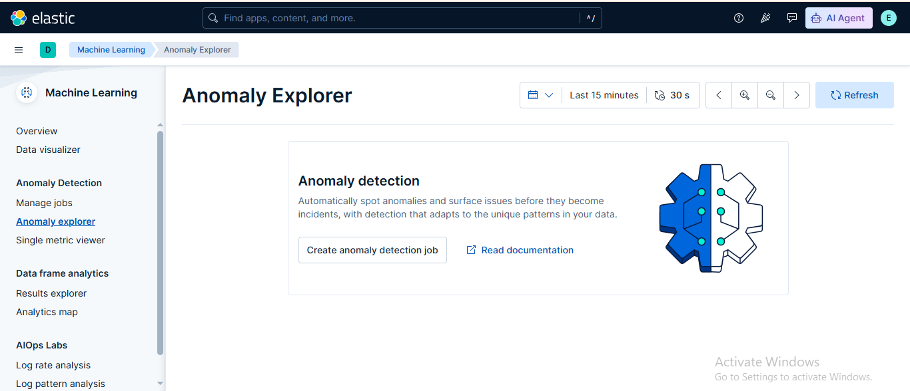

# Lab: Basics of Machine Learning in Elastic Security

## 📌 Lab Overview

In this lab, we explored the Machine Learning (ML) capabilities integrated into the Elastic Security environment. The purpose of this exercise was to understand how Elastic uses machine learning algorithms for anomaly detection and security monitoring.

We enabled a prebuilt ML job for detecting anomalous login activities and analyzed the generated security anomalies using Kibana's Machine Learning features.

---

# 🎯 Objectives

- Understand Machine Learning integration within Elastic Security.
- Learn how to navigate ML features in Kibana Security.
- Enable and manage prebuilt ML jobs.
- Detect unusual login activity using anomaly detection.
- Analyze security events using ML-driven insights.

---

# 🛠️ Lab Environment

| Component | Details |
|-----------|---------|
| SIEM Platform | Elastic Security |
| Data Platform | Elasticsearch |
| Visualization Tool | Kibana |
| Feature Used | Machine Learning |
| ML Function | Anomaly Detection |

---

# Prerequisites

Before starting this lab, the following requirements should be completed:

- Basic understanding of Elastic Stack components.
- Elasticsearch and Kibana installed and running.
- Security-related logs indexed into Elasticsearch.
- Access to Kibana Dashboard.

---

# Task 1: Navigate to Machine Learning in Kibana Security

## Access Kibana Dashboard

Open the Kibana interface using a web browser:

```
http://localhost:5601
```

Login to the Kibana dashboard and access the Elastic Security environment.

---

## Locate Machine Learning Section

From the Kibana navigation menu:

```
Machine Learning
```

The Machine Learning section provides access to ML-based analysis features.

Available ML features include:

- Anomaly Detection
- Data Frame Analytics
- Data Visualizer

---

## Explore ML Features

### Anomaly Detection

Used to identify unusual patterns in data by comparing current behavior with historical activity.

### Data Frame Analytics

Used for advanced machine learning analysis such as classification and regression.

### Data Visualizer

Used to explore datasets and understand data patterns before applying ML models.

---

# Task 2: Enable a Prebuilt ML Job - Anomalous Login Activity

## Navigate to Anomaly Detection

Go to:

```
Machine Learning → Anomaly Detection
```

Review the available prebuilt ML jobs.

---

## Select Prebuilt Job

Select:

```
Anomalous Login Activity
```

This ML job detects unusual login behavior such as:

- Abnormal login frequency.
- Unusual login locations.
- Unexpected authentication patterns.
- Suspicious user activity.

---

## Enable the ML Job

Steps:

1. Open the Anomalous Login Activity job.
2. Review job configuration.
3. Click:

```
Enable
```

4. Wait for the job to start processing data.

---

## Monitor Job Status

Navigate to:

```
Machine Learning → Job Management
```

Verify:

```
Job Status: Running
```

Monitor the processing progress and generated results.

---

# Task 3: Review and Analyze Detected Anomalies

## Access Anomaly Explorer

Navigate to:

```
Machine Learning → Anomaly Detection → Anomaly Explorer
```

The Anomaly Explorer provides a visual representation of detected security anomalies.

---

## Review Detected Anomalies

Analyze:

- Detected unusual login activities.
- Severity levels.
- Time periods of anomalies.
- Affected users or systems.

---

## Analyze Results

Review abnormal patterns such as:

- Sudden increase in login attempts.
- Login activity outside normal behavior.
- Unexpected authentication spikes.

Use available graphs and visualizations for deeper investigation.

---

# 🔐 SOC Analyst Use Cases

Machine Learning in Elastic Security helps SOC teams detect threats that may not match traditional rules.

Common use cases:

### Account Compromise Detection

```
Unusual Login Behavior
          ↓
ML Anomaly Detection
          ↓
Security Alert Generated
          ↓
SOC Investigation
```

### Other Use Cases

- Brute-force attack detection.
- Insider threat monitoring.
- Suspicious user behavior analysis.
- Malware activity detection.
- Network anomaly identification.

---

# 🧠 Key Learning Outcomes

After completing this lab:

✅ Learned how Machine Learning integrates with Elastic Security.  
✅ Explored ML features available in Kibana.  
✅ Enabled a prebuilt anomaly detection job.  
✅ Monitored ML job execution.  
✅ Analyzed suspicious login behavior using anomaly detection.  

---
# Screenshot
## Anomaly Explorer


---
# Conclusion

In this lab, we explored the Machine Learning capabilities of Elastic Security and enabled a prebuilt ML job for detecting anomalous login activities.

This exercise demonstrated how machine learning enhances SIEM capabilities by identifying abnormal behavior patterns that may indicate security threats. ML-based anomaly detection helps security teams improve threat detection and response processes.
